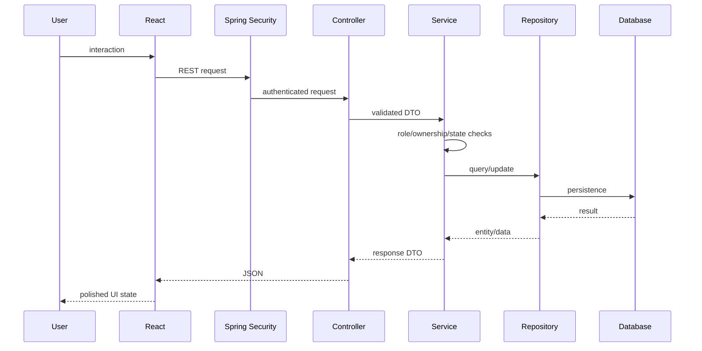

# Architecture

## 1. Style

Use a **modular monolith**:

```text
React SPA
   ↓ REST/JSON
Spring Boot
   ↓ JPA
H2 / MySQL
```

No microservices are needed.

## 2. Repository

```text
/
├── AGENTS.md
├── MASTER_SPEC.md
├── README.md
├── backend/
├── frontend/
├── docs/
└── scripts/
```

One backend app and one frontend app.

## 3. Backend

Base package:

```text
com.marketplace
```

Prefer feature-oriented packages:

```text
auth
user
candidate
employer
job
assessment
booking
verification
training
placement
replacement
notification
audit
admin
common
config
```

A feature may contain its controller/service/repository/entity/dto classes without excessive nesting.

### Layer Rules

Controller:
- transport;
- request validation;
- response/status.

Service:
- business logic;
- ownership;
- state transitions;
- transactions;
- event publication.

Repository:
- persistence/query logic.

DTO:
- API contract.

Do not expose entities directly.

## 4. Frontend

Expected organization:

```text
frontend/src/
├── app/
├── components/
├── layouts/
├── pages/
├── router/
├── services/
├── types/
└── features/
```

Feature folders are created only when used.

Suggested features:

```text
auth
candidate
employer
jobs
assessments
bookings
trade
verification
placements
replacements
training
notifications
admin
```

## 5. Request Flow



## 6. Authentication

Final M3 architecture:
- email/password login;
- BCrypt or standard Spring password encoder;
- JWT access token;
- role from authenticated User;
- account status enforced.

No refresh-token infrastructure is required.

## 7. Database

MVP uses a simplified schema in `DATA_MODEL.md`.

H2 may be used for:
- tests;
- local/demo startup.

MySQL may be used:
- final local setup;
- deployment.

Do not add database infrastructure purely for production realism.

## 8. Transactions / Concurrency

Use transactions where business correctness depends on multiple writes.

Most important:
- booking a slot;
- queue reservation;
- placement creation;
- replacement selection/completion.

Replacement candidate reservation must prevent obvious double-selection.

A reasonable JPA transaction/locking solution is enough for the university project. Do not build distributed locking.

## 9. OOP Pattern Architecture

### Strategy

```text
AssessmentStrategy
├── TechAssessmentStrategy
└── VoiceAssessmentStrategy
```

### Factory

```text
AssessmentStrategyFactory
→ chooses strategy by candidate/assessment context
```

### Singleton

```text
ReplacementQueueManager
```

Implemented as a Spring `@Service` (singleton by default).

### Observer

Spring application events/listeners.

No broker.

## 10. Voice Flow

```text
Microphone
→ Web Speech API
→ Bangla transcript
→ editable form field
→ user confirms
→ normal API request
```

No audio persistence is required.

## 11. File Handling

TECH CV:
- configurable local upload directory is sufficient;
- validate size/type;
- sanitize file name/storage path;
- store only metadata/reference in DB.

Cloud object storage is deferred.

## 12. Events

Useful events:
- `CandidateVerifiedEvent`
- `EvaluationCompletedEvent`
- `PlacementCreatedEvent`
- `ReplacementRequestedEvent`
- `ReplacementCompletedEvent`
- `ReferralCreatedEvent`

Listeners:
- Notification listener
- Audit listener

## 13. Deployment

Deployment is a late optional/showcase enhancement.

Do not block project completion on complex hosting.

A reliable local demo is acceptable. A simple hosted demo is a stretch goal if time/credits remain.
