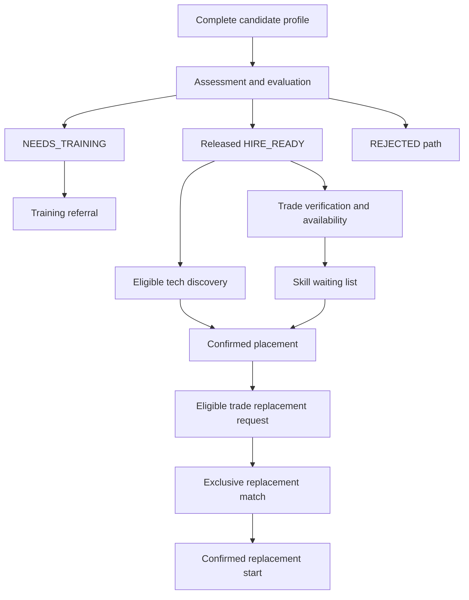

# Core Business Workflows

> M0.3 — specification/design only | Version 1.0 | 2026-09-12
> Project: Verified Skill & Career Managed Marketplace with Voice-First Accessibility
> Sources: [MASTER_SPEC.md](../MASTER_SPEC.md) and [Roles and Permissions](ROLES_AND_PERMISSIONS.md).
> No application code, schemas, seed data, automated tests, integrations, or workflow engines are implemented.

## 1. Scope and governing decisions

This document specifies business behavior and conceptual states. It does not select database constraints, locking APIs, Java enums, HTTP endpoint contracts, or libraries. All actions inherit M0.2's least-privilege, ownership, assignment, data-projection, and current-account-status requirements.

Canonical roles remain CANDIDATE, EMPLOYER, EVALUATOR, ADMIN. TECH and TRADE remain candidate types under CANDIDATE. System is a processing actor, not a new login role. Institutes remain external partners without a portal.

MVP decisions resolving previously open details:

- Public registration creates an ACTIVE account and an incomplete corresponding profile. Candidate type is chosen during candidate registration. Only CANDIDATE or EMPLOYER can be self-registered.
- Formal employer approval/verification is optional/future. An ACTIVE employer with complete company details can use basic hiring workflows; administrative review/restriction remains available.
- Queue policy is FIFO among eligible skill-matched workers, then stable entry identifier. Assessment scores determine readiness against a rubric, not priority among eligible workers.
- Hiring readiness is scoped to the relevant skill/assessment path. A released HIRE_READY evaluation plus applicable profile, verification, availability, and account checks governs hiring eligibility.
- Normal protected actions require ACTIVE. FLAGGED continues to restrict business actions as defined in M0.2; it denotes investigation, not criminal guilt.
- IN_APP is the only required MVP notification channel. Creating an in-app message means available in the recipient inbox, not read, SMS-delivered, or telephoned.
- Replacement SLA: accepted request time + 24 elapsed hours; fulfillment means a confirmed linked replacement placement has become ACTIVE. Coverage duration is separate and must be explicitly supplied by a labeled applicable policy; no real-world guarantee duration is invented.
- A replacement is ACCEPTED only after both candidate and employer confirmation. The confirmation may be recorded through authorized, attributed operational contact; administrators cannot fabricate consent or impersonate a party.
- Offer expiry is an explicit policy input recorded as a timestamp. No fixed production duration or new scheduling mechanism is imposed here.

Use absolute instants for comparisons, local display appropriate to users, and recorded policy versions for time-sensitive decisions. Retry must not reset an SLA clock. All unspecified transitions are forbidden unless a later approved revision defines them.

## 2. State vocabulary

These are independent domain concepts, not interchangeable flags.

| Domain | Confirmed or introduced states | Notes |
| --- | --- | --- |
| Account (confirmed) | ACTIVE, SUSPENDED, BLOCKED, FLAGGED | Role never overrides restrictions |
| Verification (confirmed) | PENDING, IN_REVIEW, VERIFIED, FAILED, FLAGGED | No record means not yet submitted, not VERIFIED |
| Evaluation recommendation (confirmed) | HIRE_READY, NEEDS_TRAINING, REJECTED | Scoped outcome, not account status |
| Placement (confirmed) | PENDING, ACTIVE, COMPLETED, TERMINATED, REPLACEMENT_REQUESTED, REPLACED | Original and replacement are separate records |
| Replacement (confirmed) | REQUESTED, MATCHING, CANDIDATE_SELECTED, EMPLOYER_NOTIFIED, ACCEPTED, COMPLETED, FAILED | Failure retained; controlled retry allowed |
| Referral (confirmed) | REFERRED, CONTACTED, ENROLLED, COMPLETED, CANCELLED | No automatic hiring/verification after completion |
| Profile completeness (introduced) | INCOMPLETE, COMPLETE | Derived criterion; not approval or an authentication state |
| Job (introduced) | DRAFT, ACTIVE, CLOSED, ARCHIVED | Historical records preserved |
| Assessment attempt (introduced) | NOT_STARTED, IN_PROGRESS, SUBMITTED, UNDER_REVIEW, EVALUATED, CANCELLED, EXPIRED | NOT_STARTED can be a derived pre-attempt condition, not an empty stored attempt |
| Result release (introduced) | UNRELEASED, RELEASED | Candidate release separate from explicit hiring-safe release scope |
| Booking (introduced) | BOOKED, COMPLETED, CANCELLED, NO_SHOW | One model with consultation/interview purpose |
| Queue entry (introduced) | QUEUED, RESERVED, EXITED | EXITED retains reason/history; not deletion |
| Candidate availability (introduced) | AVAILABLE, UNAVAILABLE | Self-declaration subject to reservation/placement checks |
| SLA (introduced) | PENDING, ON_TIME, BREACHED | Independent of replacement success/failure |
| Notification read state (introduced) | UNREAD, READ | Separate from delivery processing/retry metadata |

Shortlist membership is represented conceptually by active/inactive membership plus history and links to interviews/placements. Do not add a competing shortlist state machine in this module. Submission deadlines and cancellation are optional assessment-definition settings; a missing deadline never implies automatic expiry.

## 3. Workflow catalog

Each workflow includes permissions explicitly. Unless stated otherwise, mutations require authentication and ACTIVE status. Read projections and denied-action behavior follow M0.2. Successful business audits and notification intents refer to committed changes; rejection/failure records must not assert success.

### W01 — Account onboarding and authentication

**Purpose:** Create a common account without privileged self-registration.

**Actors:** Prospective candidate/employer; system. ADMIN handles trusted provisioning separately.

**Preconditions:** Identifier unused; valid registration input; supported public account choice. Registration itself does not require an existing login.

**Trigger:** User submits registration.

**Main flow**

1. Choose CANDIDATE with TECH/TRADE, or EMPLOYER.
2. Validate identifier uniqueness, contact format, required input, and password policy; reject supplied privileged roles/status fields.
3. Atomically create account, hashed credential, allowed role membership, and one corresponding INCOMPLETE profile; set account ACTIVE.
4. Confirm registration. Later authenticate credentials and current account status; record successful LOGIN; logout ends the session through the later auth design.

**Alternate flows:** A1: Existing user signs in instead. A2: Evaluator/admin provisioning uses W21, never this public flow.

**Failure cases:** F1: Duplicate/invalid identifier or password. F2: Tampered role/type. F3: Partial persistence failure rolls back account/profile creation. F4: Invalid credentials or restricted status denies protected access.

**Resulting state:** ACTIVE account with permitted membership and INCOMPLETE profile; registration alone grants no verification/readiness.

**Related permissions:** Public onboarding limited to CANDIDATE/EMPLOYER; own account thereafter.

**Business rules:** Passwords never stored/logged in plaintext. Candidate identity and type are separate. Uniqueness must hold under concurrent registration.

**Notifications:** Account-created IN_APP welcome after persistence; authentication errors produce safe user feedback, not a success message.

**Audit events:** ACCOUNT_CREATED, ROLE_CHANGED (system initial public-role assignment); LOGIN only for successful login.

**Affected data:** users, roles/user_roles, candidate_profiles or employer_profiles, notifications, audit_logs; later session metadata.

**Implementation notes:** Password strength, identifier normalization and token/session policy must be selected before auth implementation; no auth code now.

### W02 — Tech candidate onboarding

**Purpose:** Prepare a TECH candidate for assessment and eventual hiring discovery.

**Actors:** CANDIDATE (TECH); system.

**Preconditions:** Existing own ACTIVE CANDIDATE account and TECH profile from W01.

**Trigger:** Candidate resumes onboarding after login.

**Main flow**

1. Load existing own profile; do not create a duplicate.
2. Enter basic/contact and professional details; add education and experience where applicable.
3. Select at least one skill; upload a valid CV; optionally add portfolio.
4. Apply W04 completeness checks; show missing items or COMPLETE.
5. Offer applicable assessments and public job browsing; employer hiring discovery still requires a released relevant HIRE_READY result.

**Alternate flows:** A1: Save incomplete progress. A2: Student with no experience declares none rather than inventing work history.

**Failure cases:** F1: Invalid CV/fields. F2: Attempt to edit another profile/type or authoritative readiness. F3: Missing required fields keeps INCOMPLETE.

**Resulting state:** INCOMPLETE or COMPLETE TECH profile; no automatic trade verification/queue admission.

**Related permissions:** Own candidate profile/CV/skills only.

**Business rules:** CV is required for TECH completeness; portfolio is optional. Completion is not a score, verification, or placement.

**Notifications:** Optional completion/next-step notification only on an actual completion change.

**Audit events:** PROFILE_UPDATED; PROFILE_COMPLETENESS_CHANGED on change.

**Affected data:** candidate_profiles, candidate_skills, CV metadata/storage references, notification/audit records.

**Implementation notes:** Use existing registered profile and validated upload workflow; file limits/storage remain later design.

### W03 — Trade candidate onboarding

**Purpose:** Collect understandable, confirmed trade-worker information and route to review.

**Actors:** CANDIDATE (TRADE); assigned EVALUATOR/ADMIN later; system.

**Preconditions:** Own ACTIVE TRADE profile.

**Trigger:** Candidate begins/resumes simplified onboarding.

**Main flow**

1. Choose configured trade/service category, for example Driver, Electrician, AC Technician, Mechanic, Delivery Rider, or Plumber.
2. Enter required data manually or start supported Bangla speech input with permission.
3. Review/correct transcript and explicitly confirm fields before saving.
4. Apply W04; book a consultation through W10 if required.
5. Submit verification under W11 and complete applicable skill evaluation under W07/W08.
6. When all checks pass, assess queue eligibility under W12.

**Alternate flows:** A1: Unsupported recognition, denied microphone, or recognition error immediately permits equivalent manual entry. A2: Save partial profile and resume.

**Failure cases:** F1: Unconfirmed/invalid input is not silently submitted. F2: Failed/flagged verification or training need prevents hiring queue entry. F3: Category no longer valid requires correction.

**Resulting state:** Profile saved; review/evaluation progresses independently; only fully eligible worker becomes QUEUED.

**Related permissions:** Own input/booking/submission; reviewer duties separately authorized.

**Business rules:** Voice is accessibility, not biometrics or government validation. Categories are managed reference data, not a closed hard-coded list.

**Notifications:** Relevant booking, verification, evaluation, and queue messages from their owning workflows.

**Audit events:** PROFILE_UPDATED; downstream events per W07–W12.

**Affected data:** candidate_profiles, candidate_skills, optional voice_registrations metadata, bookings, verification_records, evaluations, queue history.

**Implementation notes:** Manual route must complete the same journey; raw audio retention is not required.

### W04 — Candidate profile completion and maintenance

**Purpose:** Calculate a consistent completeness gate while preserving evidence/history.

**Actors:** CANDIDATE; ADMIN for authorized support correction; system.

**Preconditions:** Existing candidate profile; own-edit scope or audited support duty.

**Trigger:** Save profile, skill or CV change.

**Main flow**

1. Validate editable fields and ownership; keep role, score, approval and priority fields outside self-edit.
2. Require basic identifying/display information, contact information, candidate type, and at least one valid relevant skill.
3. For TECH also require accepted CV metadata/upload; for TRADE require trade category and confirmed manual/transcribed information.
4. Derive COMPLETE or INCOMPLETE and show missing criteria.
5. Recheck downstream eligibility when material identity/skill/CV fields change; retain prior reviewed versions and route evidence-affecting changes for review.

**Alternate flows:** A1: Optional education/experience/portfolio absent does not fabricate missing values. A2: Removing a required item returns to INCOMPLETE.

**Failure cases:** F1: Invalid fields/unauthorized edit. F2: Stale simultaneous edit. F3: Attempt to erase referenced skills/history instead of safe revision.

**Resulting state:** Updated profile and derived completeness; existing placement history is not erased or automatically reversed.

**Related permissions:** Candidate self-edit; ADMIN operational correction; evaluator read only within assignment.

**Business rules:** Completeness never means VERIFIED/HIRE_READY. Material changes cannot keep misleading verified claims; unavailable/ineligible queue entries exit safely.

**Notifications:** Notify candidate of required correction/review; operational staff for effects on live placements.

**Audit events:** PROFILE_UPDATED, PROFILE_COMPLETENESS_CHANGED; verification/queue events if changes require them.

**Affected data:** candidate_profiles, candidate_skills, CV references, eligibility/review history.

**Implementation notes:** Exact field validation belongs to profile module; criteria above are MVP business gates, not SQL constraints.

### W05 — Employer onboarding

**Purpose:** Enable basic employer workflows without an unnecessary approval subsystem.

**Actors:** Prospective EMPLOYER; system; ADMIN oversight.

**Preconditions:** Registered ACTIVE EMPLOYER account with own profile.

**Trigger:** Company profile submitted.

**Main flow**

1. Load own profile.
2. Validate company/display name, responsible contact, location, and hiring/business description.
3. Save permitted public/private company fields and derive completeness.
4. Allow basic jobs/discovery/hiring when COMPLETE and ACTIVE.
5. Retain admin review/suspend/block operations for operational concerns.

**Alternate flows:** A1: Save incomplete details. A2: Formal approval can be introduced later through an approved policy.

**Failure cases:** F1: Missing/invalid details blocks dependent hiring actions. F2: Restricted account. F3: Other-company edit denied.

**Resulting state:** COMPLETE employer profile eligible for basic MVP workflows; no claim of verified business identity.

**Related permissions:** Own employer editing; no self-approval or role assignment.

**Business rules:** Formal employer verification is optional/future, resolving M0.1/M0.2's open policy as requested. Account ACTIVE and resource rules still apply.

**Notifications:** Profile-completion confirmation if useful; restriction notifications from W19.

**Audit events:** PROFILE_UPDATED, PROFILE_COMPLETENESS_CHANGED.

**Affected data:** employer_profiles, audit/notification records.

**Implementation notes:** No employer approval state machine or institute portal added.

### W06 — Job creation and lifecycle

**Purpose:** Publish and maintain an employer-owned hiring requirement.

**Actors:** EMPLOYER; ADMIN for moderation/operational correction.

**Preconditions:** ACTIVE employer with COMPLETE profile; ownership for edits.

**Trigger:** Save draft or publish job.

**Main flow**

1. Validate title, description, track/category, required skills, location/work arrangement and hiring terms needed for the requirement.
2. Save DRAFT if explicitly requested; otherwise require publish-complete fields and create ACTIVE job.
3. Expose only eligible ACTIVE jobs in discovery.
4. Allow owner edits within lifecycle rules; close hiring or archive with history retained.

**Alternate flows:** A1: DRAFT remains private to owner/operations. A2: Owner reopens CLOSED after revalidation. A3: ADMIN moderates via audited action.

**Failure cases:** F1: Wrong owner. F2: Invalid publish fields. F3: New hiring/shortlisting on CLOSED/ARCHIVED job. F4: Stale competing lifecycle edit.

**Resulting state:** DRAFT/ACTIVE/CLOSED/ARCHIVED per state table.

**Related permissions:** Employer own creation/edit/close/archive; ADMIN operational moderation, not impersonated creation.

**Business rules:** Closed/archived jobs accept no new actions requiring ACTIVE; existing placements and valid replacement obligations survive job closure.

**Notifications:** Owner confirmation; notify affected parties only when an existing scheduled/hiring commitment changes.

**Audit events:** JOB_CREATED, JOB_UPDATED, JOB_STATUS_CHANGED.

**Affected data:** jobs/workforce requirements, related history, notifications/audits.

**Implementation notes:** Soft lifecycle changes preserve shortlists/bookings/placements; no SQL or endpoints now.

### W07 — Candidate assessment and submission

**Purpose:** Collect a valid attempt and route scoring/review.

**Actors:** CANDIDATE; assigned EVALUATOR; ADMIN or delegated author; system.

**Preconditions:** ACTIVE candidate, COMPLETE profile, applicable published assessment and allowed attempt opportunity; definition/rubric exists.

**Trigger:** Start applicable assessment, then submit.

**Main flow**

1. Show NOT_STARTED before an attempt; starting creates IN_PROGRESS tied to definition/rubric version.
2. Save candidate's own draft answers/submission.
3. Validate deadline if configured, required answers, and attempt state; accept one SUBMITTED snapshot.
4. Auto-score objective answers against protected versioned keys where supported.
5. Route to UNDER_REVIEW if human review is required; otherwise finalize deterministic result as EVALUATED using approved rubric.
6. Keep result UNRELEASED until authorized release policy applies; W08 owns reviewed finalization/release.

**Alternate flows:** A1: Resume own IN_PROGRESS attempt. A2: Subjective/interview/trade/voice evaluation always requires appropriate human review. A3: Candidate cancels unsubmitted attempt; configured deadline can expire it.

**Failure cases:** F1: Ineligible or repeated attempt contrary to policy. F2: Late submission for timed assessment. F3: Attempt to edit submitted answers or scores. F4: Scoring failure leaves SUBMITTED pending safe retry, not fictitious result.

**Resulting state:** SUBMITTED/UNDER_REVIEW/EVALUATED, or CANCELLED/EXPIRED pre-submission; recommendation only after finalization.

**Related permissions:** Own applicable attempt; assigned review and restricted keys; no employer raw-answer access.

**Business rules:** Submitted answers immutable; no evaluator review before submission. No AI scoring. Retake is a new authorized attempt, never rewriting an evaluated attempt.

**Notifications:** Submission confirmation to candidate and assigned evaluator when review needed; released-result notice only when released.

**Audit events:** ASSESSMENT_STARTED, ASSESSMENT_SUBMITTED, EVALUATION_COMPLETED when finalized, RESULT_RELEASED.

**Affected data:** assessment definitions/questions, attempts, answers, evaluation_results, audit/notification intents.

**Implementation notes:** Submission, scoring retries and events must refer to one accepted snapshot; cancellation/expiry does not erase history.

### W08 — Evaluator review, result release and routing

**Purpose:** Produce an accountable readiness decision and control visibility.

**Actors:** Assigned EVALUATOR; ADMIN for authorized correction/release oversight; system.

**Preconditions:** SUBMITTED/UNDER_REVIEW attempt; relevant assignment; no self-review; rubric and submission available.

**Trigger:** Evaluator begins/finalizes review.

**Main flow**

1. Claim/start assigned review as UNDER_REVIEW.
2. Review permitted profile/submission, record rubric score, feedback and separate internal notes.
3. Choose HIRE_READY, NEEDS_TRAINING or REJECTED for this path; validate complete findings.
4. Finalize EVALUATED result with author/time/version.
5. Release candidate-facing result through assigned review duty; explicitly select hiring-safe summary release, excluding private notes/keys.
6. Route HIRE_READY toward eligible hiring; NEEDS_TRAINING toward W17; REJECTED stops this path without blocking the account.

**Alternate flows:** A1: Leave review incomplete without finalizing. A2: Deterministic auto-scored result can be released under a definition's explicit preapproved policy. A3: Audited correction supersedes a result version and rechecks eligibility.

**Failure cases:** F1: Unsubmitted attempt, missing assignment, self-evaluation, incomplete rubric or invalid score. F2: Conflicting reviewer update. F3: Release attempt exposes internal notes.

**Resulting state:** EVALUATED with recommendation and explicit release scopes; account status unchanged.

**Related permissions:** Assigned evaluation/scoring and permitted release; ADMIN corrections need reason and review duty.

**Business rules:** Completeness, verification, readiness and release are distinct. A released HIRE_READY is necessary but not alone sufficient for hiring. Corrections never silently overwrite official history.

**Notifications:** Candidate result-ready only on release; assigned operations of correction affecting live placement; referral notifications downstream.

**Audit events:** EVALUATION_COMPLETED, RESULT_RELEASED, EVALUATION_CORRECTED if applicable.

**Affected data:** evaluation_results and versions/release metadata, attempts, downstream eligibility/referrals.

**Implementation notes:** Rubric thresholds/retake policy must be defined per assessment; technical strategy/factory choices deferred.

### W09 — Candidate discovery and shortlisting

**Purpose:** Create one employer-owned shortlist membership for an eligible candidate/job.

**Actors:** EMPLOYER; system; CANDIDATE recipient.

**Preconditions:** Employer ACTIVE/COMPLETE and owns ACTIVE job; candidate ACTIVE/COMPLETE with relevant released HIRE_READY, applicable verification, availability and safe visibility.

**Trigger:** Employer clicks shortlist after reviewing safe profile.

**Main flow**

1. Filter search to eligible candidates and employer-safe released information.
2. Validate job ownership, candidate/job match and current eligibility.
3. Create one active membership for employer-job-candidate combination.
4. Record business event and safe candidate notification.
5. Allow owner to remove membership; link any later interview/placement without exposing employer private notes.

**Alternate flows:** A1: Repeated click returns existing membership. A2: Removed membership may be explicitly restored after full revalidation, preserving history.

**Failure cases:** F1: Wrong employer/job or inactive job. F2: Unreleased/ineligible candidate. F3: Stale candidate eligibility at save.

**Resulting state:** Active shortlist membership; not a placement or offer acceptance.

**Related permissions:** Own shortlist; candidate views only own released status.

**Business rules:** No duplicate active membership for same job/candidate. Removal is not account rejection; no private evaluator data through discovery.

**Notifications:** Candidate shortlisted notice; owner confirmation.

**Audit events:** SHORTLIST_CREATED plus correlated CANDIDATE_SHORTLISTED business audit; SHORTLIST_REMOVED on removal.

**Affected data:** Conceptual shortlist persistence (schema deferred), jobs/candidate references, notifications/audits.

**Implementation notes:** Both existing and new audit names are retained without duplicating notifications; see event catalog.

### W10 — Interview and consultation booking

**Purpose:** Reserve an appointment without exceeding capacity.

**Actors:** CANDIDATE, assigned EVALUATOR, EMPLOYER; ADMIN operational scheduler; system.

**Preconditions:** Future available slot and eligible participants; appropriate own/assigned scheduling permission.

**Trigger:** Authorized participant selects a slot.

**Main flow**

1. Identify consultation/evaluation or employer-interview purpose within one booking model.
2. For consultation, validate own candidate/assigned evaluator; for interview validate employer's ACTIVE job and candidate relationship.
3. Check future time, capacity, participant conflicts and absence of duplicate active booking.
4. Atomically create BOOKED and reserve capacity; notify participants.
5. After appointment, assigned evaluator or authorized operational admin records completion/no-show using evidence; cancellation follows table and frees capacity.

**Alternate flows:** A1: Candidate/employer cancels own future booking; assigned evaluator may cancel assigned booking. A2: Reschedule via validated cancellation/new booking, not duplicate capacity. A3: Employer reports outcome; authorized scheduler records completion if required.

**Failure cases:** F1: Past slot, full capacity, conflict or duplicate. F2: Unrelated participants/booking access. F3: Stale simultaneous reservation.

**Resulting state:** BOOKED then COMPLETED, CANCELLED or NO_SHOW.

**Related permissions:** Own/assigned bookings; evaluator own slots; ADMIN operational need.

**Business rules:** MVP capacity defaults to one per slot. No conflicting participant booking; no forced confirmation of attendance. Completion/no-show only at/after appointment end.

**Notifications:** BOOKED/CANCELLED details to participants; reschedule messages reference the new booking.

**Audit events:** BOOKING_CREATED, BOOKING_CANCELLED, BOOKING_STATUS_CHANGED.

**Affected data:** interview_slots, bookings, participant/capacity history, notification/audit intents.

**Implementation notes:** No advanced scheduling engine. Use recorded slot instants/time zone for display and validation.

### W11 — Candidate verification and re-review

**Purpose:** Record manual platform verification without claiming government validation.

**Actors:** TRADE CANDIDATE; assigned authorized verification EVALUATOR; ADMIN.

**Preconditions:** Own sufficiently complete profile and required submission; reviewers ACTIVE, assigned and not the subject.

**Trigger:** Candidate confirms verification submission.

**Main flow**

1. Validate/store minimum restricted evidence and create PENDING case.
2. Authorized reviewer opens review and transitions to IN_REVIEW.
3. Review identity/background/ethics information with attributable findings and required consultation evidence.
4. Record VERIFIED, FAILED or FLAGGED with reason and safe candidate-facing explanation.
5. Update eligibility; independently require relevant skill evaluation before queue admission.

**Alternate flows:** A1: Request additional evidence; remain IN_REVIEW until reviewed. A2: Authorized re-review of FAILED/FLAGGED returns IN_REVIEW with new evidence/version. A3: New concern on VERIFIED moves to FLAGGED and removes queue eligibility.

**Failure cases:** F1: Missing evidence or unauthorized/self-approval. F2: Conflicting review. F3: Invalid transition or exposed restricted data.

**Resulting state:** One authoritative current verification outcome with retained review history; FAILED/FLAGGED cannot enter active queue.

**Related permissions:** Candidate submits/status-limited view; only assigned verification duty/admin workflow changes outcome.

**Business rules:** Verification is not account status or a competency score. Candidate cannot edit approval fields; supplemental evidence is versioned. Demo uses fictional/manual review.

**Notifications:** Safe status/update request to candidate; operational alert for FLAGGED or effects on live placement.

**Audit events:** VERIFICATION_STATUS_CHANGED; CANDIDATE_VERIFIED on approval; CANDIDATE_FLAGGED on flagging.

**Affected data:** verification_records/evidence references and history; queue eligibility; notifications/audits.

**Implementation notes:** No government NID API or real identity data. Verification changes and selection eligibility must be consistent.

### W12 — Waiting-list enrollment

**Purpose:** Enroll eligible trade workers in a deterministic skill pool.

**Actors:** System; TRADE candidate subject; ADMIN may trigger eligibility recheck.

**Preconditions:** TRADE, ACTIVE account, COMPLETE profile, VERIFIED, relevant released HIRE_READY, valid skill, AVAILABLE, no incompatible placement/reservation, no active entry for same category.

**Trigger:** Eligibility-affecting profile, verification, evaluation or availability event.

**Main flow**

1. Re-evaluate all eligibility requirements using current data.
2. If eligible, create QUEUED entry with server-controlled joined time and stable identifier.
3. Assign ordering under section 5; do not accept priority input.
4. Persist enrollment/history and notification intent.

**Alternate flows:** A1: Duplicate trigger returns existing QUEUED/RESERVED entry. A2: Explicit re-enrollment after prior exit creates a new historical episode at current queue time.

**Failure cases:** F1: Any eligibility condition fails—no active enrollment. F2: Client attempts priority mutation. F3: Race with suspension/placement.

**Resulting state:** QUEUED for skill; candidate can see own limited status.

**Related permissions:** System admission; no candidate/employer direct queue mutation; ADMIN recheck only.

**Business rules:** One active entry per candidate/category. Multi-skill entries never allow incompatible simultaneous reservations. No jump in priority on retry.

**Notifications:** Candidate queue-entry notice; no public queue roster.

**Audit events:** QUEUE_ENTERED; safe eligibility rejection/operational event if required, not a false enrollment.

**Affected data:** waiting_list_entries/history, candidate/skill/eligibility references, audit/notifications.

**Implementation notes:** Future transactional uniqueness/recheck behavior required; no queue algorithm implemented.

### W13 — Waiting-list exit and reservation release

**Purpose:** Remove ineligible/withdrawn workers from selection while preserving history.

**Actors:** System; candidate updates own availability/withdrawal intent; ADMIN operational removal.

**Preconditions:** Existing QUEUED/RESERVED entry or live reservation.

**Trigger:** Placement selection/start, unavailability, verification loss, non-active account, withdrawal, conflicting placement, or reasoned admin removal.

**Main flow**

1. Identify affected entries/reservations and why eligibility changed.
2. For temporary selection use RESERVED; for withdrawal/ineligibility/placement use EXITED with reason/time.
3. Release any invalid reservation and unlink its active offer safely.
4. If matching was affected, rematch/mark failure under W16; notify operations for existing active placements.
5. Retain ordering, status and attempt history; re-entry requires fresh eligibility.

**Alternate flows:** A1: Offer declined/rejected while still eligible releases reservation to QUEUED at original joined time; exclude that worker from this request's current matching run. A2: True exit followed by re-enrollment joins at current time.

**Failure cases:** F1: Unauthorized priority/removal request. F2: Reservation already consumed by finalized placement—do not undo it blindly. F3: Concurrent release/select.

**Resulting state:** QUEUED after safe temporary release, RESERVED during selection, or EXITED with history.

**Related permissions:** Candidate controls availability intent only; system controls queue; ADMIN reasoned workflow.

**Business rules:** No destructive deletion. Do not penalize generic availability because an employer rejects an otherwise eligible worker. Retried release is harmless.

**Notifications:** Candidate of changed queue/opportunity; employer/admin if replacement offer invalidated.

**Audit events:** QUEUE_STATUS_CHANGED, QUEUE_EXITED, RESERVATION_RELEASED, related replacement event.

**Affected data:** queue entries/history, reservation/offer metadata, replacement request references.

**Implementation notes:** Release is conditional on still owning the active reservation; active placement resolution is a separate workflow.

### W14 — Placement creation and lifecycle

**Purpose:** Create an authoritative hiring relationship and enforce exclusivity.

**Actors:** EMPLOYER initiates; CANDIDATE confirms; system; ADMIN operational support.

**Preconditions:** Owned ACTIVE job/requirement for ordinary new hire, active parties, eligible available candidate, validated hiring decision and no incompatible reservation/placement.

**Trigger:** Employer confirms hiring intent.

**Main flow**

1. Validate ownership/current eligibility and record party agreement; create one PENDING placement with candidate, employer, requirement, type, start date and applicable guarantee policy.
2. Prevent incompatible assignment while start is pending; queue candidate is reserved or exits with placement-pending reason.
3. On confirmed start, recheck conditions and transition ACTIVE; record actual start.
4. For managed TRADE placement only, calculate coverage start/expiry from explicit applicable policy; TECH has no automatic trade guarantee.
5. Notify parties; later complete, terminate or request replacement only via allowed transitions.

**Alternate flows:** A1: Future start remains PENDING. A2: Cancelled pending hire becomes TERMINATED and releases claim. A3: Authorized admin records real party confirmation with provenance. A4: Replacement placement follows W16 and may fulfill an already-closed original job's obligation.

**Failure cases:** F1: Wrong employer/ineligible candidate. F2: Concurrent claim, missing agreement, invalid dates or missing applicable guarantee policy. F3: Attempt to reopen terminal placement.

**Resulting state:** PENDING/ACTIVE and eventual COMPLETED/TERMINATED/REPLACEMENT_REQUESTED/REPLACED per table.

**Related permissions:** Employer own workflow; candidate response only; ADMIN operational action; no evaluator fabricated placements.

**Business rules:** Official placement requires confirmed actual parties. Guarantee eligibility/expiry recorded explicitly, never assumed for every TECH hire. New replacement gets its own policy, not automatic reset of original coverage.

**Notifications:** Parties receive placement-created/start/status notices.

**Audit events:** PLACEMENT_CREATED, PLACEMENT_STATUS_CHANGED; queue/reservation events.

**Affected data:** placements, job/party links, agreement/start/guarantee metadata, queues, audits/notifications.

**Implementation notes:** Placement claim and incompatible queue effects must be atomic; coverage duration remains a policy input.

### W15 — Replacement request and SLA initialization

**Purpose:** Accept an eligible employer request once and begin measurable fulfillment.

**Actors:** EMPLOYER; system; ADMIN oversight.

**Preconditions:** Employer ACTIVE and owns original ACTIVE managed TRADE placement; guarantee enabled with recorded coverage; valid unavailability reason/state; no conflicting active request.

**Trigger:** Employer submits Request Replacement with reason.

**Main flow**

1. Authorize employer before exposing placement/policy details.
2. Validate coverage at accepted request time, placement state, reason and absence of conflicting request.
3. Atomically create REQUESTED with request timestamp, target completion timestamp and SLA PENDING; set original placement REPLACEMENT_REQUESTED.
4. Persist audit and notification intent.
5. Begin W16 matching.

**Alternate flows:** A1: Identical repeated submission returns existing request. A2: Conflicting second active request is rejected without duplication.

**Failure cases:** F1: Expired/outside coverage. F2: Wrong owner. F3: COMPLETED/TERMINATED/REPLACED placement. F4: Guarantee not applicable. F5: Concurrent request loses duplicate race.

**Resulting state:** REQUESTED, original REPLACEMENT_REQUESTED; invalid request produces no successful replacement state.

**Related permissions:** Only associated employer originates; system validates; admin cannot originate by impersonating employer.

**Business rules:** MVP coverage check is coverageStart <= requestTime < coverageExpiry; at exact expiry request is ineligible. Document policy version. Request acceptance is not an offer acceptance.

**Notifications:** Employer request confirmation and operational work item to admin.

**Audit events:** REPLACEMENT_REQUESTED, PLACEMENT_STATUS_CHANGED; rejected attempt may have safe denial audit.

**Affected data:** replacement_requests, original placement, policy/timestamps/SLA, audit/notification intents.

**Implementation notes:** Duplicate check and placement/request changes form one consistent operation; auth/state errors follow M0.2.

### W16 — Replacement matching, confirmation, completion and recovery

**Purpose:** Find the next eligible worker, secure agreement, or preserve explicit failure.

**Actors:** System queue/replacement workflow; candidate and employer confirm; ADMIN oversees retries/failures.

**Preconditions:** REQUESTED request, or authorized retry of FAILED/unfulfilled request; original obligation unresolved; no conflicting active request; active employer.

**Trigger:** Matching begins or previous offer fails.

**Main flow**

1. Enter MATCHING; determine required skill/constraints and select eligible entries under section 5.
2. Recheck and atomically reserve the highest-ranked candidate with recorded offer expiry; enter CANDIDATE_SELECTED.
3. Create candidate offer and safe employer IN_APP details; once employer message is persisted, enter EMPLOYER_NOTIFIED (not READ).
4. Obtain both party confirmations before offer expiry and recheck eligibility; enter ACCEPTED.
5. Create/link one replacement placement and finalize its confirmed start as ACTIVE.
6. Atomically mark original REPLACED, request COMPLETED, actual completion time/SLA result, and consume/release relevant reservations; notify parties.

**Alternate flows:** A1: Candidate declines, employer rejects, offer expires, or availability changes: record reason, release safely, return MATCHING and try the next eligible not-yet-tried worker. A2: Accepted offer falls through before start: terminate its PENDING placement, release claim and rematch. A3: Technical notification failure retains selection for retry, subject to expiry. A4: ADMIN may retry FAILED after availability changes under the original accepted obligation without resetting SLA.

**Failure cases:** F1: Empty/exhausted queue -> FAILED with reason; original remains REPLACEMENT_REQUESTED. F2: Reservation race -> retry selection without double assignment. F3: Eligibility/consent missing -> no ACCEPTED/COMPLETED. F4: Request withdrawn or employer restricted -> release claims, FAILED with reason and operational review.

**Resulting state:** Success: new placement ACTIVE, old REPLACED, request COMPLETED; failure: retained FAILED and unresolved original until fulfilled or authorized closure.

**Related permissions:** Employer sees own safe offer; candidate sees selected opportunity; system processes; ADMIN can retry/resolve, never bypass FIFO/eligibility or fabricate success.

**Business rules:** Both parties must confirm. At most one incompatible candidate claim and one active offer per request. No self/previous unavailable worker selected for this same replacement incident. SLA and coverage are separate; retries of accepted obligation do not require extending original coverage.

**Notifications:** Selected offer to parties; employer failure notice/admin escalation; completion messages. Original worker receives only relevant own-placement status.

**Audit events:** REPLACEMENT_STATUS_CHANGED, REPLACEMENT_CANDIDATE_SELECTED, RESERVATION_RELEASED, REPLACEMENT_COMPLETED, PLACEMENT_CREATED/STATUS_CHANGED, SLA_BREACHED when applicable.

**Affected data:** request/matching attempt history, reservation/offer metadata, original/new placements, queues, SLA/audit/notifications.

**Implementation notes:** Concurrent matching, expiry, acceptance and completion require consistent state checks. No locks/timers/queue code chosen now.

### W17 — Training referral

**Purpose:** Connect a documented skill gap to an appropriate partner program.

**Actors:** Assigned EVALUATOR, ADMIN, system; CANDIDATE; external institute.

**Preconditions:** Relevant released NEEDS_TRAINING evaluation; active candidate for new referral; matching available program/institute.

**Trigger:** Evaluator/admin confirms referral recommendation or configured matching rule proposes it.

**Main flow**

1. Identify relevant skill gap and appropriate program; no AI recommendation required.
2. Create unique REFERRED for this candidate/evaluation/program and notify candidate.
3. Candidate contacts/enrolls externally if desired.
4. Assigned referral evaluator or operational admin records CONTACTED, ENROLLED and COMPLETED using evidence; record CANCELLED when discontinued.
5. Keep completion distinct from a new assessment/verification decision.

**Alternate flows:** A1: No suitable program -> retain NEEDS_TRAINING, notify operational staff; no fake referral. A2: Candidate declines -> authorized operator records CANCELLED. A3: Additional suitable program requires intentional separate referral.

**Failure cases:** F1: Unauthorized update or no matching recommendation/program. F2: Duplicate generation. F3: Unsupported status jump/unsubstantiated enrollment.

**Resulting state:** REFERRED -> CONTACTED -> ENROLLED -> COMPLETED, or CANCELLED.

**Related permissions:** Candidate own visibility only; assigned evaluator/admin creates/updates; institute has no portal authority.

**Business rules:** Do not charge for basic job access or automate commissions/payments. Evidence and actor required for operational status; completion is not HIRE_READY.

**Notifications:** Candidate referral/new status notice; assigned staff on unmatched program.

**Audit events:** REFERRAL_CREATED, REFERRAL_STATUS_CHANGED.

**Affected data:** referrals, program/institute/evaluation links, status evidence/history, notifications/audits.

**Implementation notes:** No institute login, payment gateway or automated invoicing; re-evaluation is a separate attempt.

### W18 — Notification generation and reading

**Purpose:** Inform correct recipients of committed business outcomes.

**Actors:** System listeners; recipient role; ADMIN limited operational delivery management.

**Preconditions:** Committed event/intent with unique correlation, configured rule and authorized recipient.

**Trigger:** Business event from catalog; recipient opens own inbox.

**Main flow**

1. Resolve notification rule and minimal safe content.
2. Persist one IN_APP notification per event-recipient-rule with UNREAD state.
3. Make it available only to intended recipient; reference resource with its normal access checks.
4. Recipient marks own message READ; repeated mark-read is harmless.
5. Retry failed creation/delivery intent without duplicate messages.

**Alternate flows:** A1: No user-facing rule -> audit-only event. A2: Restricted user retains message for permitted future access; notification does not restore account permissions.

**Failure cases:** F1: Missing/invalid recipient or unsafe data -> do not send; retain operational failure. F2: Rolled-back event -> no success notice. F3: Unauthorized inbox read denied.

**Resulting state:** Persisted UNREAD/READ record or retained retryable failure; no claim of external delivery.

**Related permissions:** Own inbox/read marking; admin authorized operational messages, not private inbox impersonation.

**Business rules:** IN_APP required; EMAIL/SMS/VOICE_CALL future. Notification creation must not recursively generate itself. Retrying must not recreate an already-read record as unread.

**Notifications:** This workflow creates the messages in section 7; it does not notify users about every notification creation.

**Audit events:** NOTIFICATION_GENERATION_FAILED for operational failures where appropriate; business event already audited; no recursive audit/notification chain.

**Affected data:** notifications, recipient/rule/correlation and retry metadata.

**Implementation notes:** Delivery processing and read status are distinct. Required durable intent strategy chosen later; no service now.

### W19 — Account suspension, blocking, flagging and reinstatement

**Purpose:** Restrict access and reevaluate dependent workflows without erasing history.

**Actors:** ACTIVE authorized ADMIN; system propagation; affected account.

**Preconditions:** Privileged account-status management; legitimate reason; current status known.

**Trigger:** Admin chooses permitted status action.

**Main flow**

1. Validate actor, target, transition and required reason.
2. Commit new status; ACTIVE allows normal checks, SUSPENDED temporary restriction, BLOCKED disabled until privileged intervention, FLAGGED investigation with M0.2 access restriction.
3. Ensure current protected operations cannot rely on old token/role to bypass restriction; session mechanism deferred.
4. Exit affected candidate queues/release offers; disallow new hiring on restricted employer accounts; reassign review work of restricted evaluators.
5. Notify operations about active placements/bookings for explicit resolution, audit and issue safe account-status notice.

**Alternate flows:** A1: Authorized review returns account ACTIVE; re-evaluate eligibility rather than automatically restoring old queue priority. A2: Future automated decisions require separately authorized policy.

**Failure cases:** F1: Unauthorized actor or missing reason. F2: Stale conflicting status. F3: Attempt to delete past work or automatically treat flag as guilt.

**Resulting state:** Account status updated; dependent eligibility revoked/rechecked; historical placements/results retained.

**Related permissions:** ADMIN status operation only; role membership unchanged.

**Business rules:** Existing sessions must not keep business authority contrary to current status. Do not silently terminate real placements or cancel appointments solely by deleting records; admin coordinates explicit transitions.

**Notifications:** Affected user receives safe notice retained in inbox; relevant operations/parties receive minimal necessary interruption information.

**Audit events:** ACCOUNT_STATUS_CHANGED plus queue/reservation and other actual transition events.

**Affected data:** users status/history, authorization/session metadata later, queue/offers and operational follow-up, audits/notifications.

**Implementation notes:** Denial becomes effective with status change; asynchronous cleanup must not leave a selectable ineligible candidate. Session implementation deferred.

### W20 — Audit event generation

**Purpose:** Retain attributable evidence of security and business actions.

**Actors:** System event handling; authorized ADMIN reader.

**Preconditions:** Known actor/system origin, action, entity context and outcome; committed mutation for success record.

**Trigger:** Auditable action, transition or relevant rejected attempt.

**Main flow**

1. Capture actor, action, entity type/ID, timestamp, correlation, outcome and safe metadata.
2. For mutation success, persist audit or guaranteed audit intent consistently with domain change.
3. Expose read-only records to authorized operational admins.
4. Correlate events and technical failures without including secrets or restricted evidence.

**Alternate flows:** A1: Denial/error audit records attempted outcome separately from success. A2: Trusted role provisioning uses same audit policy. A3: Retry intent does not duplicate same audit event identity.

**Failure cases:** F1: Required audit cannot be secured -> sensitive mutation must not report success. F2: Sensitive payload filtered/rejected. F3: Ordinary audit update/delete denied.

**Resulting state:** Immutable normal-workflow audit history or visible operational failure; no fictional successful business event.

**Related permissions:** System writes; ADMIN authorized read only. No normal role deletes evidence.

**Business rules:** Never log passwords/hashes, JWTs/secrets, DB credentials, raw NID/audio, or unnecessary private notes. Audit generation must not recursively audit itself.

**Notifications:** No routine per-audit notification; operational alarm only for audit persistence failures.

**Audit events:** Catalog in section 7; audit writer does not emit another copy of its own audit event.

**Affected data:** audit_logs, correlation/intent metadata as later designed.

**Implementation notes:** No log service/viewer implemented. Avoid an event storm between audit/notification observers.

### W21 — Privileged role assignment

**Purpose:** Preserve controlled role changes needed by onboarding and governance.

**Actors:** Authorized ADMIN; trusted bootstrap process for first admin; affected user.

**Preconditions:** Trusted privileged operation with reason, target, supported role and safeguards; no public selection of ADMIN/EVALUATOR.

**Trigger:** Authorized grant/revoke request.

**Main flow**

1. Check authority, conflict-of-interest and role-change safeguards.
2. Record intended memberships without conflating candidate type.
3. Commit role change and audit together; reconcile required profiles/assignments and current session authority.
4. Notify target of role change and route incompatible pending work for reassignment.

**Alternate flows:** A1: Initial public registration grants its single permitted role through W01. A2: Bootstrap first ADMIN uses explicit trusted setup, never public endpoint.

**Failure cases:** F1: Self-promotion or client-forged membership. F2: Last-admin/self-affecting operation before policy allows it. F3: Concurrent membership edit or failed audit.

**Resulting state:** Authorized membership change with history; no automatic change to candidate type/account status.

**Related permissions:** Only trusted administrative assignment; ADMIN is not automatic ownership of employer/candidate records.

**Business rules:** Multi-role architecture remains possible; no self-review. Initial admin and last-admin safeguards must be finalized before identity implementation.

**Notifications:** Safe role-change notice to target; operations for reassignment.

**Audit events:** ROLE_CHANGED.

**Affected data:** user_roles, domain-profile linkage/history where relevant, audit/notification/session metadata.

**Implementation notes:** Included as supporting governance workflow; no role entities or authorization code now.

## 4. Valid state transitions

Tables define permitted transitions only when actor permission, current account status, ownership/assignment and business guards pass. Unlisted transitions are illegal. Duplicate delivery of an already-applied action is a no-op with the original outcome, not permission to re-run side effects. Corrections preserve versions/history rather than silently rewriting terminal records.

### 4.1 Verification

| Current | Action and actor/guard | Next |
| --- | --- | --- |
| No case | Candidate submits required own information | PENDING |
| PENDING | Assigned authorized reviewer starts | IN_REVIEW |
| IN_REVIEW | Authorized reviewer approves complete case; no self-review | VERIFIED |
| IN_REVIEW | Reviewer rejects with evidence/reason | FAILED |
| IN_REVIEW | Reviewer flags unresolved concern | FLAGGED |
| VERIFIED | Authorized new concern/revocation review; eligibility removed | FLAGGED |
| FAILED or FLAGGED | Authorized reviewer reopens with evidence/reason/history | IN_REVIEW |

Illegal: candidate sets VERIFIED; PENDING directly to VERIFIED; FAILED directly to VERIFIED; re-review that leaves revoked evidence usable for selection. No case must not be displayed as a submitted PENDING case without submission.

### 4.2 Placement

| Current | Action and guard | Next |
| --- | --- | --- |
| No placement | Authorized confirmed hiring workflow | PENDING |
| PENDING | Actual start confirmed; parties/eligibility rechecked | ACTIVE |
| PENDING | Hiring cancelled or start fails; claims released | TERMINATED |
| ACTIVE | Engagement finishes normally | COMPLETED |
| ACTIVE | Engagement ends without accepted replacement process | TERMINATED |
| ACTIVE | Eligible employer request accepted atomically | REPLACEMENT_REQUESTED |
| REPLACEMENT_REQUESTED | Linked replacement starts ACTIVE and request finalized | REPLACED |
| REPLACEMENT_REQUESTED | Authorized closure without replacement; unresolved request ended, claims released | TERMINATED |

COMPLETED, TERMINATED and REPLACED are terminal in normal workflow. No transition to PENDING from a completed record. A failed replacement leaves original REPLACEMENT_REQUESTED until retry or explicit closure. No implicit return to ACTIVE or deletion. If original engagement must resume, a separately approved reconciliation policy is required. Starting a replacement cannot overwrite the original candidate ID.

### 4.3 Replacement

| Current | Action and meaning | Next |
| --- | --- | --- |
| No request | Eligible employer request accepted; SLA starts | REQUESTED |
| REQUESTED | Queue search begins | MATCHING |
| MATCHING | Eligible worker exclusively reserved, offer/expiry recorded | CANDIDATE_SELECTED |
| CANDIDATE_SELECTED | Safe employer IN_APP offer persisted/available | EMPLOYER_NOTIFIED |
| EMPLOYER_NOTIFIED | Both party confirmations; valid unexpired offer | ACCEPTED |
| ACCEPTED | Linked replacement starts ACTIVE; original finalized | COMPLETED |
| CANDIDATE_SELECTED or EMPLOYER_NOTIFIED | Decline, employer rejection, expiry or lost eligibility; release | MATCHING |
| ACCEPTED | Start/offer fails before ACTIVE; terminate pending replacement/release | MATCHING |
| MATCHING | No eligible untried workers; reason retained | FAILED |
| REQUESTED, CANDIDATE_SELECTED, EMPLOYER_NOTIFIED or ACCEPTED | Unrecoverable invalidity/withdrawal; release all claims, record reason | FAILED |
| FAILED | ADMIN-authorized retry of same unresolved accepted obligation; audit reason | MATCHING |

COMPLETED is terminal. FAILED remains unsuccessful history even when reopened; preserve attempts and original timestamps. No direct REQUESTED → COMPLETED, no acceptance without valid reservation and both confirmations, no successful completion merely for notification or a PENDING placement.

For an employer withdrawal while MATCHING, transition to FAILED with withdrawal reason and stop/release any selection. Admin closure of the original obligation subsequently uses the placement TERMINATED transition.

### 4.4 Referral

| Current | Authorized action | Next |
| --- | --- | --- |
| No referral | Assigned evaluator/admin or configured validated system workflow creates | REFERRED |
| REFERRED | Assigned evaluator/admin records contact evidence | CONTACTED |
| CONTACTED | Assigned evaluator/admin records enrollment evidence | ENROLLED |
| ENROLLED | Assigned evaluator/admin records completion evidence | COMPLETED |
| REFERRED, CONTACTED or ENROLLED | Assigned evaluator/admin records decline/discontinuation reason | CANCELLED |

Candidate/institute cannot directly update operational states. COMPLETED/CANCELLED are terminal; a deliberate later referral is a new record. No automatic REFERRED → COMPLETED or COMPLETED → HIRE_READY. If contact and enrollment are reported together, record both successive transitions and evidence, not an unexplained jump.

### 4.5 Booking

| Current | Action and guard | Next |
| --- | --- | --- |
| No booking | Authorized future-slot reservation with capacity | BOOKED |
| BOOKED | Own/assigned authorized cancellation before start; or reasoned admin correction | CANCELLED |
| BOOKED | Assigned evaluator/operational admin confirms completion at/after end | COMPLETED |
| BOOKED | Assigned evaluator/operational admin records absence at/after end | NO_SHOW |

Terminal states do not return to BOOKED; reschedule creates a new booking. No future booking can be marked completed/no-show. Cancellation releases applicable capacity once; completion/no-show retains attendance history. A participant report alone is not authority to edit another user's booking.

### 4.6 Assessment and release

| Current | Action and guard | Next |
| --- | --- | --- |
| NOT_STARTED | Eligible candidate starts | IN_PROGRESS |
| IN_PROGRESS | Valid one-time submission before configured deadline | SUBMITTED |
| IN_PROGRESS | Candidate cancels before submission | CANCELLED |
| IN_PROGRESS | Configured deadline reached without accepted submission | EXPIRED |
| SUBMITTED | Human review required; assigned review starts | UNDER_REVIEW |
| SUBMITTED | Supported auto-scoring and approved rubric finalize | EVALUATED |
| UNDER_REVIEW | Assigned reviewer finalizes | EVALUATED |
| UNRELEASED result | EVALUATED result; authorized release/policy and field scope | RELEASED |

Attempt CANCELLED/EXPIRED/EVALUATED are terminal normally. At exact assessment deadline submission is late when a deadline exists. Submitted attempts never expire as if unsubmitted simply because evaluation is delayed. No answer editing after SUBMITTED. Released-result correction creates a superseding version, initially UNRELEASED, with prior version/history retained and eligibility rechecked; no unrestricted reverse transition or silent overwrite.

### 4.7 Job, queue, profile and account

| Domain/current | Action | Next |
| --- | --- | --- |
| Job: no record | Save incomplete draft / publish validated job | DRAFT / ACTIVE respectively |
| Job: DRAFT | Owner validates and publishes | ACTIVE |
| Job: DRAFT | Owner archives abandoned draft | ARCHIVED |
| Job: ACTIVE | Owner/admin closes hiring | CLOSED |
| Job: CLOSED | Owner revalidates and reopens | ACTIVE |
| Job: CLOSED | Owner/admin archives | ARCHIVED |
| Queue: no active entry | All eligibility checks pass | QUEUED |
| Queue: QUEUED | System acquires exclusive claim | RESERVED |
| Queue: RESERVED | Offer released, candidate still eligible | QUEUED |
| Queue: QUEUED or RESERVED | Withdrawal/ineligibility/placement/operational removal | EXITED |
| Profile: INCOMPLETE | All required criteria pass | COMPLETE |
| Profile: COMPLETE | Required criterion no longer passes | INCOMPLETE |
| Account: ACTIVE | Authorized admin restriction with reason | SUSPENDED, BLOCKED or FLAGGED |
| Account: SUSPENDED or FLAGGED | Admin escalation/reclassification with reason | BLOCKED (or SUSPENDED from FLAGGED) |
| Account: SUSPENDED, BLOCKED or FLAGGED | Privileged review approves reinstatement | ACTIVE |

Job ARCHIVED is terminal; close ACTIVE first before archiving. Queue EXITED is historical; renewed eligibility creates a new enrollment episode, not a rewritten old joined time. Account status is not switched by assessment REJECTED or verification FLAGGED automatically; an account restriction is a separate authorized operation. Notification UNREAD → READ is recipient-only and repeat-safe; no unread reset on delivery retry.

## 5. Queue ordering, reservation and recovery policy

1. Filter for exact required category/skill and job-specific requirements, current ACTIVE account, COMPLETE TRADE profile, VERIFIED verification, relevant released HIRE_READY, AVAILABLE, and no incompatible placement/reservation.
2. Exclude original unavailable worker and already-tried workers for the current request's matching run.
3. Order remaining eligible entries by server-recorded joined time ascending, then stable entry ID ascending. Scores do not reorder equally eligible workers.
4. Recheck the chosen worker and claim eligibility atomically. One candidate's multiple skill entries must not defeat exclusivity.
5. Record request, candidate, selected entry, selection time, policy/version and expiry. Reservation metadata is conceptual; no new mandatory table selected here.
6. Release only the still-current claim; stale retry must not release a claim owned by another request.
7. If merely declined/rejected but still eligible, restore QUEUED with original time for other requests; do not repeatedly offer the same worker in this run. If unavailable/withdrawn/unverified/restricted, EXITED.
8. Exhaustion makes FAILED, not success or invisible deletion. Notify employer/admin and retain reason/attempts. A later authorized retry starts a new matching run, retains history/SLA, and explicitly decides whether a previously declining worker has newly confirmed availability.
9. Admin may retry, remove for a legitimate operational reason, or close an obligation with audit; cannot change priority or waive eligibility.
10. An expired offer cannot be accepted. Expiry and acceptance races have one authoritative outcome. Numeric offer-expiry duration is a later policy input; the chosen timestamp must exist before an offer is issued.

A technical notification outage alone should not instantly declare the worker unavailable. Retain retry intent, respect expiry, and expose operational failure. No matching loop is permitted to continually select a worker who declined the current offer.

## 6. Guarantee coverage and 24-hour SLA

The operational promise is replacement within 24 hours; software records whether it happened and cannot promise human availability.

| Field/concept | MVP meaning |
| --- | --- |
| Guarantee eligibility | Explicit on managed TRADE placement; not automatic for TECH |
| Coverage start/expiry and policy version | Recorded from applicable coverage policy; duration remains configurable/undecided commercially |
| Request timestamp | Instant the eligible request is accepted by the system |
| Target completion timestamp | Request timestamp plus 24 elapsed hours |
| Actual completion timestamp | Instant confirmed replacement placement becomes ACTIVE and replacement finalization commits |
| SLA PENDING | Target not yet passed and no on-time completion |
| SLA ON_TIME | Completed at or before target |
| SLA BREACHED | Target passed without completion, or completed after target |

Coverage uses start-inclusive/expiry-exclusive request acceptance. A request accepted during coverage may complete after coverage expiry; its accepted obligation and SLA remain. Do not reject a legitimate retry solely because coverage subsequently expired.

At exact SLA target, completed work is ON_TIME; an unfinished request becomes BREACHED once time exceeds the target. FAILED before the target may still have SLA PENDING until it becomes overdue; failure status itself already shows non-fulfillment. A late completion remains BREACHED. No retry, offer change or administrator action resets request/target times.

If an obligation is closed/cancelled without completion, retain null actual completion, failure/closure reason, and the missed-target outcome once due; never mark ON_TIME merely because an administrator closed it. Any commercial exclusion or clock-pause policy requires a future explicit decision. Do not implement timers or jobs now; the later system must evaluate overdue unresolved requests even if no one opens them.

## 7. Events, notifications and audit mapping

All business events below refer to committed outcomes. Required notification persistence/intent must survive ordinary processing retry; handlers deduplicate by event/recipient/rule. Payloads contain safe identifiers and summaries, not evidence, secrets or internal feedback.

| Business action/event | IN_APP recipients | Audit action(s) |
| --- | --- | --- |
| Account created | Account owner | ACCOUNT_CREATED, ROLE_CHANGED for initial membership |
| Successful login | No routine notice required | LOGIN |
| Profile change/completeness | Owner if actionable; operations for live-impact review | PROFILE_UPDATED, PROFILE_COMPLETENESS_CHANGED |
| Job created/updated/status | Employer; affected parties only for commitment changes | JOB_CREATED, JOB_UPDATED, JOB_STATUS_CHANGED |
| Assessment submitted | Candidate; assigned reviewer if needed | ASSESSMENT_SUBMITTED |
| Evaluation finalized | Assigned operations if needed; candidate only once released | EVALUATION_COMPLETED |
| Result released/corrected | Candidate; relevant operations for withdrawn eligibility | RESULT_RELEASED, EVALUATION_CORRECTED if correction |
| Shortlist created | Candidate; employer confirmation | SHORTLIST_CREATED, CANDIDATE_SHORTLISTED |
| Shortlist removed | Candidate if previously notified | SHORTLIST_REMOVED |
| Booking created/cancelled/outcome | Participants, minimal details | BOOKING_CREATED, BOOKING_CANCELLED, BOOKING_STATUS_CHANGED |
| Verification changed/completed | Candidate; operations for flagged/live impacts | VERIFICATION_STATUS_CHANGED; CANDIDATE_VERIFIED or CANDIDATE_FLAGGED as applicable |
| Queue entered/exited/reserved/released | Candidate own status; impacted offer parties | QUEUE_ENTERED, QUEUE_EXITED, QUEUE_STATUS_CHANGED, RESERVATION_RELEASED as applicable |
| Placement created/changed | Actual parties | PLACEMENT_CREATED, PLACEMENT_STATUS_CHANGED |
| Replacement requested | Employer and operations | REPLACEMENT_REQUESTED |
| Replacement candidate selected | Selected candidate and employer safe offer | REPLACEMENT_CANDIDATE_SELECTED, REPLACEMENT_STATUS_CHANGED |
| Replacement failed/retried | Employer and admin operations | REPLACEMENT_STATUS_CHANGED with reason |
| Replacement completed | Replacement parties; original candidate own placement status | REPLACEMENT_COMPLETED, REPLACEMENT_STATUS_CHANGED, PLACEMENT_STATUS_CHANGED |
| SLA first becomes breached | Employer and operations | SLA_BREACHED |
| Referral created/changed | Candidate; assigned staff if actionable | REFERRAL_CREATED, REFERRAL_STATUS_CHANGED |
| Account restricted/reinstated | User plus necessary operational follow-up | ACCOUNT_STATUS_CHANGED |
| Role granted/revoked | Target and affected operations | ROLE_CHANGED |
| Notification/audit processing failed | Operational alert only, no recursive notices | NOTIFICATION_GENERATION_FAILED or safe operational failure record |

M0.1 event names CANDIDATE_SHORTLISTED, CANDIDATE_VERIFIED and REPLACEMENT_COMPLETED remain supported. The newly requested SHORTLIST_CREATED denotes record creation; CANDIDATE_SHORTLISTED denotes the correlated business outcome. When both are recorded, they share correlation and produce one notification per recipient, not two. Status-change audits complement named outcome events rather than renaming historical vocabulary.

Audit minimum fields: actor (or system identity), action, entity type, entity ID, timestamp, outcome, correlation and non-sensitive metadata such as previous/next state and safe reason code. Required audits include all requested LOGIN, PROFILE_UPDATED, JOB_CREATED, JOB_UPDATED, ASSESSMENT_SUBMITTED, EVALUATION_COMPLETED, VERIFICATION_STATUS_CHANGED, CANDIDATE_FLAGGED, SHORTLIST_CREATED, PLACEMENT_CREATED, PLACEMENT_STATUS_CHANGED, REPLACEMENT_REQUESTED, REPLACEMENT_STATUS_CHANGED, REFERRAL_CREATED, ACCOUNT_STATUS_CHANGED and ROLE_CHANGED.

Never store raw passwords, password hashes, tokens/JWT secrets, database passwords, NID evidence, raw voice records, or unrestricted notes in logs. Ordinary workflows cannot modify/delete audit evidence. Future EMAIL/SMS/VOICE_CALL are not required channels; IN_APP available does not imply recipient read.

## 8. Cross-workflow dependencies

| Prerequisite | Downstream behavior | Gate |
| --- | --- | --- |
| Account + profile | Applicable assessment and onboarding | ACTIVE, COMPLETE, correct candidate type |
| EVALUATED + released HIRE_READY | Eligible employer discovery/shortlisting | Skill match, safe release; other current checks |
| EVALUATED + released NEEDS_TRAINING | Training referral | Matching available program and assigned duty |
| EVALUATED + REJECTED | Stop this assessment path | Does not block account |
| TRADE completeness + verification + skill evaluation | Queue admission | VERIFIED, relevant HIRE_READY, AVAILABLE, no incompatible claim |
| Queue candidate selection + confirmed hire | Placement | Exclusive claim, real parties, correct job ownership |
| Active covered TRADE placement + unavailability | Replacement request | Ownership, coverage and duplicate checks |
| Replacement offer + both confirmations + actual start | Finalized replacement | Valid reservation and atomic placement linkage |
| Account/verification/availability restriction | Queue exit and offer re-evaluation | No stale authorization or eligibility |
| Committed domain action | Audits and intended notifications | Safe payloads, deduplication, no rollback success |

The diagram summarizes dependencies, not a mandatory ordering of all reviews; TRADE verification and skill evaluation may proceed independently, but both must succeed before queue admission.

## 9. End-to-end fictional demo

This is a narrative, not seed data. All people/companies and policy values here are fictional.

Preparation: an admin configures an AC Technician category, a manual skill assessment/rubric, a consultation slot, and a clearly labeled **demo-only seven-day coverage policy** and **two-hour offer expiry policy**. A trusted evaluator/admin account exists. These numbers are illustrative, not final production/commercial terms.

1. Candidate A Demo registers as CANDIDATE/TRADE and completes the same verification/readiness requirements described below before the employer hires them.
2. Rahim Demo registers CANDIDATE/TRADE; account ACTIVE and profile INCOMPLETE.
3. Rahim selects AC Technician and enters Bangla speech where supported, or equivalent manual fields.
4. Rahim reviews/confirms input, contact and skill details; profile COMPLETE; availability AVAILABLE.
5. Rahim books a future consultation; booking BOOKED; capacity reserved.
6. Assigned evaluator records the completed consultation and submitted practical/interview skill evaluation.
7. Authorized verification reviewer records PENDING → IN_REVIEW → VERIFIED using fictional evidence.
8. Assigned evaluator finalizes EVALUATED/HIRE_READY and releases the safe result; no self-review.
9. Rahim now passes all queue gates and joins QUEUED for AC Technician.
10. Demo Facilities Ltd. registers EMPLOYER, completes its profile, and publishes an ACTIVE workforce requirement; no formal approval gate in this MVP.
11. Employer confirms hiring Candidate A Demo and that worker's agreement. Placement goes PENDING → ACTIVE on the recorded actual start.
12. Candidate A's demo coverage is recorded for seven days; incompatible queue entries exit. Rahim remains eligible in the queue.
13. On demo day 2 at 09:00 UTC, Candidate A becomes unavailable while coverage is valid.
14. Employer requests replacement; accepted at 09:00; request REQUESTED; original placement REPLACEMENT_REQUESTED; target day 3 at 09:00.
15. System enters MATCHING, filters eligible workers, and selects Rahim by FIFO; an exclusive two-hour demo reservation is recorded at 09:10.
16. Request becomes CANDIDATE_SELECTED; safe offer notifications are persisted, then EMPLOYER_NOTIFIED.
17. Rahim and employer confirm before 11:10; request ACCEPTED. This is not yet fulfilled.
18. A linked replacement placement is created PENDING. At 12:00 on day 2, Rahim's actual start is confirmed and the new placement becomes ACTIVE.
19. Atomically finalize request COMPLETED, original placement REPLACED, actual completion 12:00, SLA ON_TIME, and consume the reservation/exit incompatible queues.
20. Show each party's permitted notifications and admin audit history, including request/selection/acceptance/start, without exposing restricted evidence.

“Replacement completed” means the replacement process is complete and its new placement ACTIVE; it does not mean the new employment engagement's placement status is COMPLETED.

## 10. Failure demo scenarios

| Scenario | Expected result and retained evidence |
| --- | --- |
| A: Employer requests after guarantee expiry, including exact expiry boundary | Reject; no REQUESTED record/placement transition or success notice; safe rejection feedback/audit |
| B: TRADE candidate not VERIFIED | No active queue enrollment; show own missing eligibility; preserve verification history |
| C: Candidate submits queue priority | Unsupported/forbidden; 403 if exposed protected action; priority unchanged |
| D: Employer edits another employer's job | 403 or consistent ownership-concealing 404; no modification |
| E: Replacement queue has no eligible workers | Request FAILED with reason; original remains REPLACEMENT_REQUESTED; employer/admin notified; SLA still tracked |
| F: Selected worker becomes unavailable | Release current claim, EXITED if ineligible; return MATCHING; next eligible worker offered; preserve failed attempt |
| G: Both employers target same worker concurrently | At most one incompatible claim wins; loser selects next worker or fails explicitly |
| H: Two users book last slot concurrently | At most capacity bookings accepted; loser gets conflict; no double reservation |
| I: Duplicate submit/shortlist/request/referral | Existing logical action returned or conflicting duplicate rejected; no duplicated outcome |
| J: Candidate/employer rejects offer or expiry wins race | Release, skip candidate for run, rematch; no late acceptance using expired reservation |
| K: Valid request remains unfinished after target | SLA BREACHED with alert; no fictional completion; later success remains BREACHED |
| L: Assessment REJECTED | Stops that assessment path; account remains ACTIVE unless separate authorized status action |
| M: Account FLAGGED while token/offer exists | Normal protected actions denied; selection invalidated/rechecked, operational follow-up; no allegation of guilt |
| N: Delivery processing fails or transaction rolls back | Retained safe retry intent where committed; no duplicate or rollback-success notifications |

## 11. Transaction and concurrency requirements

No low-level locking strategy is selected. These are required invariants for later implementation.

| Workflow/race | Consistency boundary | Required result |
| --- | --- | --- |
| Registration / duplicate identifier | Account + role + matching profile + audit intent | No partial account or duplicate identity |
| Placement creation/start | Eligibility + exclusive candidate claim + placement + queue effects | No two incompatible placements/claims |
| Replacement selection | Candidate-wide eligibility + reservation + offer/request state | At most one active reservation for mutually incompatible placements |
| Replacement completion | Current offer/consent + new ACTIVE placement + original REPLACED + request COMPLETED + completion time | All authoritative outcomes agree, or none reported complete |
| Booking / final capacity | Participant/slot checks + booking/capacity reservation | No capacity overflow or conflicting participant bookings |
| Duplicate replacement request | Original placement eligibility + request uniqueness + status/SLA | One conflicting active request per original placement; no SLA reset |
| Assessment double submit | Accepted answer snapshot + attempt state + scoring/review intent | One immutable accepted submission/outcome |
| Verification versus selection | Review state/effective eligibility + queue/offer recheck | Revoked/flagged candidate cannot be newly reserved or finalized as eligible |
| Suspension versus business action | Current status + authorization/eligibility check | Stale token does not preserve forbidden authority |
| Role change | Membership + audit + authority reconciliation | No privileged grant without audit; no stale permission bypass |
| Concurrent state updates | Expected current state/version + allowed transition | No lost update or overwriting a newer terminal outcome |
| Release versus accept/expiry | Current claim owner/state/expiry + consent | Exactly one outcome; stale release cannot free another request's claim |
| Domain events | Committed mutation + audit/notification intent | No ghost success; retryable side effects and stable correlation |

The later implementation must define durable post-commit processing or equivalent reliable intent persistence without requiring microservices or distributed infrastructure. Essential audit failure must not allow an unrecorded sensitive success. Event retries cannot independently redo hiring or queue assignment.

## 12. Duplicate-action and retry rules

| Repeated action | Logical identity | Required behavior |
| --- | --- | --- |
| Shortlist click | Employer/job/candidate active membership | Return existing membership; no repeated event/notice |
| Assessment submit | Attempt and accepted submission | Same retry returns accepted outcome; changed submitted answers rejected |
| Booking click | Actor/participants/slot/purpose active booking | Return existing booking for same intent, conflict for incompatible duplicate; one capacity use |
| Replacement request | Original placement/incident and active accepted request | Same retry returns request; conflicting duplicate rejected; timestamps unchanged |
| Referral generation | Candidate/evaluation version/program referral intent | Return existing referral; new referral requires explicit distinct intent |
| Queue enrollment | Candidate/category active episode | Return active entry; no priority bump/reset |
| Candidate selection retry | Request/current offer and candidate claim | Reuse valid offer; no second active reservation |
| Replacement completion | Accepted offer and linked replacement placement | Return completed result; never create another replacement placement |
| Notification/audit replay | Stable event identity; recipient/rule for notification | Exactly one logical record per intended effect |
| Role/status repeated save | Target, expected state and action intent | No duplicate transition or authority escalation |
| Reservation release | Current claim identifier/owner | Already released is harmless; unrelated claim untouched |

An intentional new attempt, later referral, or re-enrollment after true exit is not a transport retry. Preserve distinguishing history and reason. Duplicate prevention must be enforced server-side even if the frontend disables buttons.

## 13. Inspection, assumptions and compatibility

Before M0.3, repository main contained MASTER_SPEC.md and docs/ROLES_AND_PERMISSIONS.md only. Both were fully reviewed; no additional docs, README or application source existed.

No approved role, type, or existing status name is replaced. No unresolved M0.1 policy is silently treated as production commercial policy. The current prompt authorizes defining MVP behavior where prior documents deferred it.

Potential differences resolved by preserving prior decisions:

- Prompt allows unspecified FLAGGED impact; M0.2 already denies normal protected actions. That restriction is retained.
- Prompt suggests admin queue override; M0.2 forbids arbitrary priority edits. Only audited removal/recheck/retry remains allowed.
- Suggested score ranking does not replace prior FIFO direction. Scores gate readiness; FIFO among eligible workers is now the defined MVP policy.
- Newly requested audit names complement earlier names; historical CANDIDATE_SHORTLISTED/CANDIDATE_VERIFIED/REPLACEMENT_COMPLETED are preserved.
- Employer approval was open, not mandatory. This module chooses the prompt's simpler optional/future formal verification policy.

Assumptions explicitly chosen: ACTIVE public accounts with incomplete profiles; TECH CV completeness requirement; relevant released HIRE_READY before hiring/queue eligibility; one-capacity slots; dual-party replacement confirmation; actual start as SLA fulfillment; exclusive coverage expiry; safe same-request failure retry without clock reset. These are conceptual MVP decisions and must be referenced by future implementation.

Still required before affected implementation: production guarantee duration/exclusions and renewal policy, offer-expiry duration, per-assessment rubrics/deadlines/retakes, detailed form/DTO fields and privacy retention, initial-admin/security safeguards, and employer organization membership. The fictional demo values do not settle these production choices.

The historical stop-at-M0.1/M0.2 statements apply to those modules; this separately requested M0.3 is documentation only and authorizes no M0.4 work.

## 14. Implementation priority

### MVP critical

W01 account onboarding, W02/W03 candidate onboarding, W04 candidate profiles, W05 employer profiles, W06 jobs, W07 assessment, W08 evaluation, W09 shortlisting, W10 basic booking, W11 verification, W12/W13 queue entry/exit, W14 placement, W15/W16 replacement/SLA, W17 referrals, W18 notifications, W19 account restrictions, W20 audit generation, and W21 trusted role assignment.

### Important but secondary

Advanced booking options, rich audit viewer, queue administration tools, advanced candidate search. Basic booking, required audit generation/read access, and operational failure visibility are still MVP requirements.

### Future

Real SMS, real voice calls, email delivery integration, government NID integration, AI assessment/scoring, automated invoicing/payments/commissions, advanced recommendation engine, institute portal, and formal employer verification.

M0.3 ends with this specification and concise master updates. No application code, automated tests, seed data, dependencies, or implementation work has been created. Do not proceed to M0.4 under this module.
