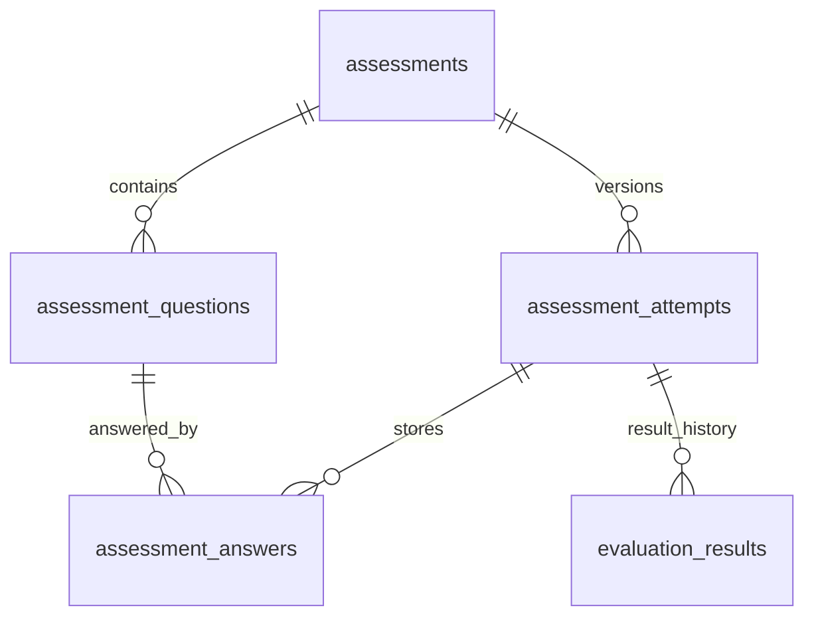

# Logical Database Plan

> M0.5 | Version 1.0 | Planning-level relational schema only.
> No SQL, migrations, entities, indexes or database configuration is created.

## 1. Authority and conventions

Follow [MASTER_SPEC.md](../MASTER_SPEC.md), [workflows](BUSINESS_WORKFLOWS.md), [roles](ROLES_AND_PERMISSIONS.md), [standards](DEVELOPMENT_STANDARDS.md) and [architecture](ARCHITECTURE.md). [API_SPEC.md](API_SPEC.md) exposes permitted projections, not these persistence records. [ROADMAP.md](ROADMAP.md) assigns schema work to M2.

Target MySQL; H2 is useful for some development/tests but does not prove MySQL locking/constraint behavior. Table/column names use snake_case; application fields/JSON use camelCase. Persist business enums as strings where practical. Important times use absolute instants with documented semantics.

Final ID strategy (Long/UUID), exact SQL/time types, nullability details, migrations, locking and index implementation remain for M2. Use consistent core IDs; FK references below indicate logical relationships, not SQL declarations. Common id/created_at/updated_at fields apply where appropriate; do not impose inheritance or universal soft-delete columns.

## 2. Core table catalog and fields

### Identity and candidate

| Table | Conceptual fields | Relationships and authority |
| --- | --- | --- |
| users | id, email, password_hash, account_status, created_at, updated_at | Shared auth identity; unique normalized email; no plaintext password; status ACTIVE/SUSPENDED/BLOCKED/FLAGGED |
| roles | id, name | Unique canonical CANDIDATE/EMPLOYER/EVALUATOR/ADMIN; no TECH/TRADE roles |
| user_roles | user_id, role_id | Unique pair; many-to-many architecture, normal onboarding one operational role |
| candidate_profiles | id, user_id, candidate_type, full_name, phone, location, bio, education_summary, experience_summary, portfolio_reference, cv_metadata_reference, availability_status, created_at, updated_at | One profile per candidate user; TECH/TRADE; AVAILABLE/UNAVAILABLE; owner only for editable fields |
| skills | id, name, category, active | Managed skills/trades such as Java, Driving or AC Repair are examples, not exhaustive |
| candidate_skills | candidate_id, skill_id, proficiency_level | Unique active association; proficiency is self-declared unless backed by explicit evaluation |

Profile INCOMPLETE/COMPLETE is derived using W04 criteria; a materialized profile_status is optional only with a single defined recalculation mechanism. Do not add a writable duplicate verificationStatus to candidate_profiles. Current verification comes from verification_records; readiness comes from released evaluation_results; actual eligibility additionally checks account/availability/claims.

CV metadata may be an owned storage metadata value/reference; final file-metadata table or embedded fields are an M5.4/M2 refinement. No mandatory raw binary column, raw path disclosure, or arbitrary client storage-key assignment.

### Employer and jobs

| Table | Conceptual fields | Relationships and rules |
| --- | --- | --- |
| employer_profiles | id, user_id, company_name, industry, contact_phone, address/location, description, created_at, updated_at | One per employer user; formal approval optional/future; company completeness derived |
| jobs | id, employer_id, title, description, location, employment_type, candidate_type, status, created_at, updated_at | Belongs to employer; DRAFT/ACTIVE/CLOSED/ARCHIVED; required skill associations below |

Employer organization membership/delegation is not implicitly modeled as all accounts sharing all company data. Final multi-user organization policy remains open. Public company fields and private contacts must be projected separately.

### Assessments

| Table | Conceptual fields | Relationships and rules |
| --- | --- | --- |
| assessments | id, title, candidate_type, skill_id, definition_version, rubric_reference, active, deadline_policy, created_at, updated_at | Versioned definition/rubric; not an AI engine |
| assessment_questions | id, assessment_id, position, question_type, prompt, options/reference, protected_answer_key, maximum_score | One definition/version has many questions; keys restricted |
| assessment_attempts | id, candidate_id, assessment_id/version, status, started_at, deadline_at, submitted_at, assigned_evaluator_id | Candidate has many attempts; one immutable accepted submission; assignment required for review |
| assessment_answers | id, attempt_id, question_id when applicable, response/submission_reference, created_at | Attempt has many answers; question must belong to captured assessment version; structured practical/interview submission may differ |
| evaluation_results | id, attempt_id, reviewer_user_id when human, strategy/rubric_version, score, recommendation, candidate_feedback, internal_notes, release_status, released_at, hiring_release_scope, version, supersedes_result_id, created_at | Attempt has result version history with one authoritative current version; automatic provenance separate from human author |

Attempt lifecycle: NOT_STARTED is a pre-attempt derived condition; stored attempt starts IN_PROGRESS, then SUBMITTED, UNDER_REVIEW where needed, EVALUATED; CANCELLED/EXPIRED only under W07 rules. Do not create empty NOT_STARTED records for every candidate/assessment.

Evaluation recommendation HIRE_READY/NEEDS_TRAINING/REJECTED is not account status. UNRELEASED/RELEASED and hiring-safe release scope control visibility. A correction creates a version rather than overwriting a released result. Snapshot/version storage representation is selected in M2.4, but mutable definition changes cannot alter old scoring.

### Appointments, voice and verification

| Table | Conceptual fields | Relationships and rules |
| --- | --- | --- |
| interview_slots | id, evaluator_user_id or authorized host reference, starts_at, ends_at, capacity, created_at | Defines availability; MVP capacity one; no past booking |
| bookings | id, slot_id, candidate_id, employer_id nullable for consultation, purpose, job_id nullable for consultation, status, created_by, created_at, updated_at | BOOKED/COMPLETED/CANCELLED/NO_SHOW; authorized participant references; no over-capacity/conflicting bookings |
| voice_registrations | id, candidate_id, transcript, language, confirmed_at, created_at | Restricted optional confirmed transcription/metadata; not a biometric identity |
| verification_records | id, candidate_id, version, status, submitted_at, reviewer_user_id, reviewed_at, evidence_references, restricted_findings, candidate_safe_feedback, supersedes_record_id | Authoritative current case plus retained review/version history; PENDING/IN_REVIEW/VERIFIED/FAILED/FLAGGED |

IDENTITY, BACKGROUND and ETHICS are conceptual check categories inside the candidate verification case, not three independent approvals that automatically imply overall VERIFIED. Preserve one authoritative current overall outcome covering required checks and the appropriate duty/assignment. If normalized check rows are later needed, document their aggregation before implementation; no additional type/status model imposed now.

Voice content is restricted; prefer retaining only needed confirmed fields/metadata. Audio is not required; if later authorized, store a reference with explicit access/retention rather than a large unbounded binary. Supplemented evidence and re-review cannot silently erase earlier findings. No government verification integration implied.

### Placements, queues and replacement

| Table | Conceptual fields | Relationships and rules |
| --- | --- | --- |
| placements | id, candidate_id, employer_id, job_id, placement_type, status, planned_start_at, actual_start_at, guarantee_eligible, coverage_start_at, guarantee_expires_at, guarantee_policy_snapshot/version, agreement_provenance, created_at, updated_at | Candidate/employer parties; managed TRADE policy distinct from TECH; ordinary MVP hiring links a requirement |
| waiting_list_entries | id, candidate_id, skill_id, status, joined_at, reserved_at, exited_at, exit_reason, current_claim_reference, created_at, updated_at | QUEUED/RESERVED/EXITED; candidate/skill episode history; FIFO joined_at then stable ID |
| replacement_requests | id, placement_id, reason, safe_notes, status, requested_at, target_completion_at, actual_completion_at, failure_reason, replacement_placement_id nullable, created_at, updated_at | Original placement owns employer; request/target times never reset; links new replacement placement separately |

placement_type reflects TECH/TRADE engagement classification, not a new user role. Do not treat planned start date as actual start. Job linkage may be nullable only for a separately approved direct-workforce requirement model; default MVP links the known job/requirement. A replacement can honor an existing obligation after the job closes.

Original placement status: PENDING/ACTIVE/COMPLETED/TERMINATED/REPLACEMENT_REQUESTED/REPLACED. Request status: REQUESTED/MATCHING/CANDIDATE_SELECTED/EMPLOYER_NOTIFIED/ACCEPTED/COMPLETED/FAILED. New replacement must be ACTIVE when request COMPLETED and original REPLACED.

SLA PENDING/ON_TIME/BREACHED is derived from fixed request target and actual completion/current time; if persisted for reporting, define consistent overdue refresh, not a second truth. Target = accepted request + 24 elapsed hours. Coverage start inclusive/expiry exclusive; target equality completion on time. Duration and offer-expiry values remain explicit policy inputs.

Employer_id may be derived via original placement; a stored duplicate must be constrained/validated to agree. Selected candidate is derived from the current valid offer; do not keep independent conflicting selected_candidate_id. No freely writable priority; ordering metadata is server-produced explanatory data only.

### Training, notifications and audit

| Table | Conceptual fields | Relationships and rules |
| --- | --- | --- |
| training_institutes | id, name, description, contact/reference, active, created_at, updated_at | Admin-managed external partner; no institute role |
| training_programs | id, institute_id, skill_id, title, description, active, created_at, updated_at | Institute has programs; simple matching by relevant gap/skill |
| referrals | id, candidate_id, evaluation_result_id, program_id, status, status_evidence_reference, created_by, created_at, updated_at | REFERRED/CONTACTED/ENROLLED/COMPLETED/CANCELLED; assigned evaluator/admin operational updates |
| notifications | id, user_id, channel, event_type, title, message, entity_type/id, event_id, rule_id, read_at, created_at | channel IN_APP; UNREAD/READ derived from read_at; no contradiction with a separate read boolean |
| audit_logs | id, actor_user_id nullable for system, actor_kind, action, entity_type, entity_id, outcome, correlation_id/event_id, metadata, created_at | System-originated records explicit; no secrets/evidence; immutable through normal workflows |

Separate notification channel (IN_APP, future EMAIL/SMS/VOICE_CALL) from business event type. Being available in inbox is not read or externally delivered. Deduplicate event-recipient-rule. Audit polymorphic entity references are conceptual; do not claim one ordinary FK can point at every table.

## 3. Supporting relationships required by approved workflows

The 25 core tables above remain the baseline. The following four supporting tables are justified by existing W06/W09/W10/W16, not new product features; exact normalization is finalized during M2.

| Supporting table | Needed fields/purpose | Why needed |
| --- | --- | --- |
| job_skills | job_id, skill_id, requirement metadata; unique pair | Job skill matching cannot rely on free-text description alone |
| shortlist_entries | id, job_id, candidate_id, active, created_at, removed_at/history reference | Persist one active shortlist membership, removals/restoration and ownership through job |
| replacement_offers | id, request_id, candidate_id, queue_entry_id, selected_at, expires_at, candidate_confirmed_at, employer_confirmed_at, released_at, release_reason, replacement_placement_id | Keep each selection/decline/expiry and both confirmations; select current offer explicitly without losing failed attempts |
| booking_notes | id, booking_id, author_user_id, restricted_notes, consultation_outcome, created_at/version | Assigned interview notes and operational evidence without exposing them in general booking DTOs |

A candidate-wide claim must cover regular PENDING/ACTIVE placements AND replacement offers across all skill entries. M2.7 must choose an enforceable MySQL-compatible representation/transaction protocol; per-skill uniqueness alone is insufficient. No claim that these draft columns solve concurrency by themselves.

Status transitions, reviewer assignments and evidence changes require preserved history. M2 must choose appropriate version/history storage for non-audit operational needs; audit records complement, not replace, data needed to execute retries/current-state decisions. Reliable event intent/retry persistence may be introduced when justified, but no broker or blanket extra table catalog is invented.

## 4. Relationship summary

| Parent | Cardinality / child | Ownership |
| --- | --- | --- |
| User | 0..1 candidate profile; 0..1 employer profile; many role memberships | Profile existence requires relevant membership; role removal preserves historical data |
| Candidate | Many skill links, attempts, verification versions, queue episodes, placements, referrals | Self-edit only own input; official outcomes platform-controlled |
| Employer | Many jobs and placements | Owner checks through authenticated employer relationship |
| Assessment version | Many questions and attempts | Attempt answers bound to captured version |
| Attempt | Many answers and result versions | One current finalized/released result version when applicable |
| Slot | Bookings up to valid capacity | Participants and assigned scheduler |
| Original placement | Many historical replacement requests; at most one conflicting active request | Associated employer |
| Replacement request | Many offers; at most one active offer; at most one finalized replacement placement | System-selected worker and original employer |
| Skill | Many eligible queue entries | Candidate-wide claim applies across skills |
| Institute | Many programs → many referrals | Admin partner management |
| User | Many notifications | Only intended recipient; audit access separate |

Cardinalities describe logical planning; published/version snapshot enforcement is a database design decision, not this diagram alone.

## 5. Constraint and index candidates

Evaluate in actual MySQL implementation: unique normalized users.email, roles.name, user_roles pair; unique candidate_profiles.user_id/employer_profiles.user_id; unique candidate_skills and job_skills pairs; appropriate mandatory/FK data; one active shortlist, booking relationship, candidate/skill queue membership and conflicting replacement request.

Active conditional uniqueness, participant time overlap, capacity and candidate-wide claims need deliberate transaction/constraint design. Do not prematurely specify partial-index syntax that differs between MySQL and H2. Retained historical episodes must not be prevented by a naive unconditional lifetime uniqueness constraint.

Probable query indexes: email; candidate_type/location; authoritative verification status/current case; job employer/status/location; skill relations; queue skill/status/joined_at/ID; request placement/status/requested_at; notification user/read_at/created_at; audit timestamp/action/entity/actor. Final ordering/composite indexes follow actual query plans, not speculative indexing of every field.

## 6. Privacy and history

Restrict password_hash, contact data, NID/evidence references, internal notes, voice content and emergency contacts according to M0.2. Store only necessary information; development/demo uses fictional identities. Employer APIs return safe DTOs, never entire candidate/verification rows.

Retain placements, attempts, requests/offers, referrals, queue exits and audit evidence. Configurable records use active/archive semantics where needed; no universal deleted_at on every table. File retention and privacy deletion require later explicit policy rather than destructive cascades of business history.

## 7. Deferred implementation and consistency

Core states and roles are unchanged. Conceptual check categories, derived profile/SLA/read-state views, selected-offer linkage and supporting tables clarify sources of truth without changing workflows.

Before implementation decide ID/types, version/current-record constraints, exclusive claim mechanism, migration strategy, result release details, upload metadata and history storage. No table is implemented, populated or asserted production-ready here.
