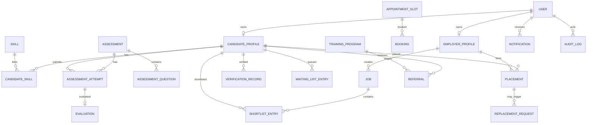

# Simplified Data Model

## 1. Goal

Use enough relational structure to demonstrate good design without implementing a production-scale schema.

Exact IDs/column types follow the established Java/JPA conventions in the repository.

Enums should normally be stored as strings.

## 2. User

Fields:
- id
- email (unique)
- passwordHash
- role: `CANDIDATE | EMPLOYER | EVALUATOR | ADMIN`
- accountStatus: `ACTIVE | SUSPENDED | BLOCKED | FLAGGED`
- createdAt
- updatedAt

MVP simplification:
- one primary role per account;
- no `roles` / `user_roles` many-to-many system is required.

## 3. CandidateProfile

Fields:
- id
- userId (unique)
- candidateType: `TECH | TRADE`
- fullName
- phone
- location
- bio
- educationSummary
- experienceSummary
- availability: `AVAILABLE | UNAVAILABLE`
- primaryTradeCategory nullable
- portfolioUrl nullable
- cvStoredName/cvOriginalName/cvContentType nullable
- createdAt
- updatedAt

Candidate owns editable profile fields.

Authoritative verification/assessment/placement state lives in dedicated records.

## 4. EmployerProfile

Fields:
- id
- userId (unique)
- companyName
- industry
- contactPhone
- address
- description
- createdAt
- updatedAt

## 5. Skill

Fields:
- id
- name (unique)
- category/type
- active

## 6. CandidateSkill

Fields:
- id
- candidateId
- skillId
- proficiencyLevel optional

Constraint:
- one active candidate-skill association per pair.

## 7. Job

Fields:
- id
- employerId
- title
- description
- location
- requiredSkillId optional
- candidateType optional
- status: `DRAFT | ACTIVE | CLOSED`
- createdAt
- updatedAt

`ARCHIVED` is unnecessary for the showcase unless implementation already contains it.

## 8. ShortlistEntry

Fields:
- id
- jobId
- candidateId
- createdAt

Constraint:
- no duplicate active job/candidate shortlist entry.

## 9. Assessment

Fields:
- id
- title
- candidateType
- skillId optional
- durationMinutes optional
- passingScore optional
- active
- createdAt

## 10. AssessmentQuestion

Fields:
- id
- assessmentId
- prompt
- optionA
- optionB
- optionC
- optionD
- correctOption
- points

Correct answer must never be sent to the candidate assessment UI.

## 11. AssessmentAttempt

Fields:
- id
- assessmentId
- candidateId
- status: `IN_PROGRESS | SUBMITTED | EVALUATED`
- answersJson or other simple persisted answer representation
- autoScore nullable
- startedAt
- submittedAt nullable
- evaluatedAt nullable

This simplified answer representation is intentional for the university MCQ use case.

## 12. Evaluation

Fields:
- id
- attemptId
- evaluatorUserId nullable for automatic evaluation
- score
- recommendation: `HIRE_READY | NEEDS_TRAINING | REJECTED`
- candidateFeedback
- internalNotes
- released
- createdAt

Only released safe output is shown outside evaluator/admin context.

## 13. AppointmentSlot

Fields:
- id
- evaluatorUserId optional
- startTime
- endTime
- capacity
- active

## 14. Booking

Fields:
- id
- slotId
- candidateId
- employerId nullable
- purpose: `CONSULTATION | INTERVIEW`
- status: `BOOKED | COMPLETED | CANCELLED | NO_SHOW`
- notes nullable
- createdAt

## 15. VerificationRecord

Fields:
- id
- candidateId
- status: `PENDING | IN_REVIEW | VERIFIED | FAILED | FLAGGED`
- reviewerUserId nullable
- identityReference/masked identity field as needed for demo
- reviewerNotes
- submittedAt
- reviewedAt nullable

Do not store real NID data in demo/seed data.

The project represents platform/manual verification, not a government API.

## 16. TrainingProgram

Fields:
- id
- providerName
- title
- skillId optional
- description
- active

A separate TrainingInstitute table is optional and not required for the showcase.

## 17. Referral

Fields:
- id
- candidateId
- trainingProgramId
- createdByUserId
- status: `REFERRED | CONTACTED | ENROLLED | COMPLETED | CANCELLED`
- createdAt

## 18. WaitingListEntry

Fields:
- id
- candidateId
- skillId
- status: `QUEUED | RESERVED | EXITED`
- joinedAt
- reservedAt nullable
- exitReason nullable

Rules:
- candidate must be verified and available;
- duplicate active entry for same candidate/skill is prohibited;
- queue order is server-controlled.

## 19. Placement

Fields:
- id
- candidateId
- employerId
- jobId nullable
- skillId
- status: `PENDING | ACTIVE | COMPLETED | TERMINATED | REPLACED`
- startDate
- guaranteeEligible
- guaranteeExpiresAt nullable
- createdAt

## 20. ReplacementRequest

Fields:
- id
- placementId
- employerId
- reason
- status:
  - `REQUESTED`
  - `MATCHING`
  - `CANDIDATE_SELECTED`
  - `ACCEPTED`
  - `COMPLETED`
  - `FAILED`
- selectedCandidateId nullable
- replacementPlacementId nullable, unique (links the resulting placement)
- requestedAt
- targetCompletionAt
- actualCompletionAt nullable
- slaStatus: `PENDING | ON_TIME | BREACHED`
- failureReason nullable

The older `EMPLOYER_NOTIFIED` state is not required as a persisted domain state; notification can be represented by Notification records.

## 21. Notification

Fields:
- id
- userId
- type
- title
- message
- readAt nullable
- createdAt

Only `IN_APP` is required.

## 22. AuditLog

Fields:
- id
- actorUserId nullable
- action
- entityType
- entityId
- details nullable and non-sensitive
- createdAt

Keep audit implementation lightweight.

## 23. Relationship Sketch

## 24. Important Constraints

At minimum:
- unique user email;
- one candidate/employer profile per user;
- unique candidate skill pair;
- unique shortlist job/candidate pair;
- no duplicate active waiting-list candidate/skill entry;
- no incompatible double reservation;
- no conflicting active replacement request for one placement;
- booking capacity/conflict enforced by service/transaction logic.

Do not spend large effort on database-specific partial-index tricks for the showcase.

## 25. M2 Persistence Decisions

- IDs are generated `Long` values; relationships use lazy JPA foreign keys without cascading deletes. Enums are persisted as strings. Timestamps use `Instant` (UTC); placement start date uses `LocalDate`.
- User email is trimmed/lowercased on JPA insert/update and uniquely constrained. Candidate/employer ownership is unique per profile table. Authentication and role/profile consistency are service responsibilities in M3.
- MCQ `answersJson` is a text LOB containing a JSON object mapping question IDs to `A`/`B`/`C`/`D`, for example `{"12":"B"}`. M5 validates answer shape, question ownership and scoring. One evaluation is allowed per attempt.
- Queue rows derive nullable `activeMembership` and `reservationMarker` flags from status. Unique constraints prevent duplicate active candidate/skill membership and simultaneous reservations across skills; null flags preserve multiple historical EXITED rows. Check constraints keep the markers consistent with status.
- Replacement rows similarly derive `activeRequest`: true for REQUESTED through ACCEPTED, null for FAILED/COMPLETED. A placement can have only one active request. A retry reuses its request and original clock; service validation must reject retries that conflict with another active request. The resulting placement is linked by a unique nullable foreign key.
- Queue `joinedAt` and replacement request/target timestamps are not updated by JPA after insertion. FIFO uses joined time then ID, with an index supporting skill/status filtering.
- Candidate, slot, queue, placement and replacement repositories provide pessimistic row-lock queries; mutable reservation-related records also have optimistic versions. Later transactional services must lock the candidate before cross-skill eligibility/reservation/placement changes, lock slots for capacity changes, recheck state after locking and apply a consistent lock order. M2 does not implement booking capacity, role/ownership authorization, eligibility or replacement orchestration.
- Dev/test create the schema from mappings in ephemeral H2. Production retains MySQL schema validation; live MySQL provisioning/connectivity has not been tested in M2.
