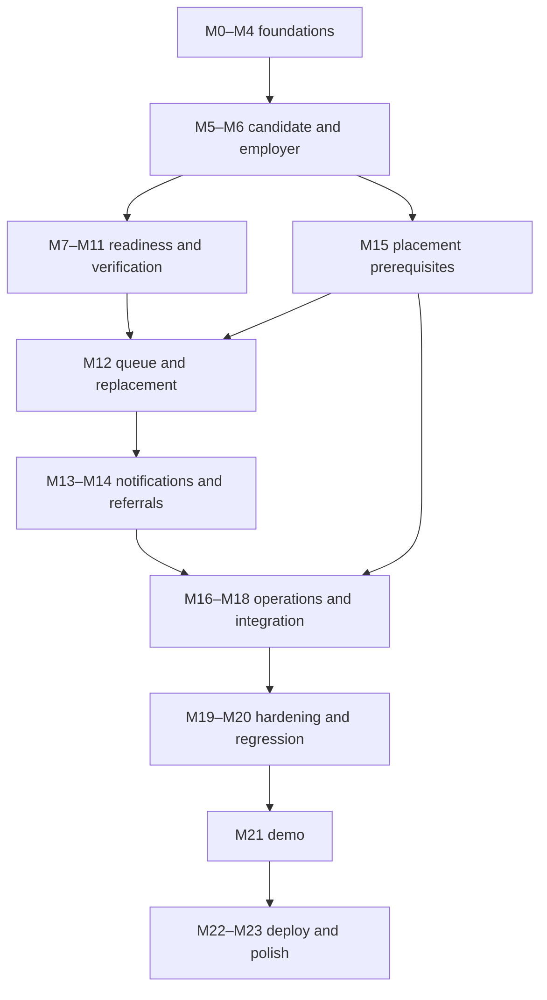

# Development Roadmap

> M0.6 | Version 1.1 | 2026-09-12 | Roadmap and baseline progress
> Canonical IDs M0–M23 are fixed. No implementation is authorized by this roadmap alone.

## Authority and progress

Follow [MASTER_SPEC.md](../MASTER_SPEC.md), [roles](ROLES_AND_PERMISSIONS.md), [workflows](BUSINESS_WORKFLOWS.md), [standards](DEVELOPMENT_STANDARDS.md), [architecture](ARCHITECTURE.md), [database plan](DATABASE.md) and [API plan](API_SPEC.md). Each has a distinct purpose; do not copy behavior between documents and allow it to drift.

Progress states: NOT_STARTED (no implementation), IN_PROGRESS (active partial work), BLOCKED (named unmet dependency), DONE (deliverable and applicable verification evidenced). Maintain module rows and evidence/remaining work as each task completes. Parent milestone is DONE only when all children are DONE; a mix of completed/future children is IN_PROGRESS.

M0.1–M0.5 documentation was complete at commit 6e8066c. M0.6 adds the verified repository baseline: root README, .gitignore, .editorconfig, blank .env.example, and tracked backend/frontend/scripts placeholders. M0.1–M0.6 and parent M0 are DONE. All M1–M23 remain NOT_STARTED. No application framework or business feature exists.

## Canonical milestone and submodule register

### M0 — Project Definition & Codex Foundation

Milestone status: DONE.

| ID | Deliverable | Status |
| --- | --- | --- |
| M0.1 | Master specification | DONE |
| M0.2 | Roles and permissions | DONE |
| M0.3 | Business workflows | DONE |
| M0.4 | Development standards | DONE |
| M0.5 | Formal roadmap and technical documentation | DONE |
| M0.6 | Repository initialization and baseline project structure | DONE |

Acceptance/dependency notes: Evidence: MASTER_SPEC.md, ROLES_AND_PERMISSIONS.md, BUSINESS_WORKFLOWS.md, DEVELOPMENT_STANDARDS.md and the four M0.5 documents. M0.6 evidence: root baseline files and backend/frontend/scripts placeholders, with Git ignore, link and text checks.

### M1 — Repository & Development Environment

Milestone status: NOT_STARTED.

| ID | Deliverable | Status |
| --- | --- | --- |
| M1.1 | Finalize Development-Ready Monorepo Structure | NOT_STARTED |
| M1.2 | Initialize Spring Boot backend | NOT_STARTED |
| M1.3 | Initialize React frontend | NOT_STARTED |
| M1.4 | Environment configuration | NOT_STARTED |
| M1.5 | Development environment verification | NOT_STARTED |

Acceptance/dependency notes: M1.1 realizes/validates the baseline from M0.6; M1.2 chooses compatible stable Java/Spring Boot/Maven dependencies; M1.3 chooses compatible frontend versions. M1.4 configures examples, profiles, origins and secrets. M1.5 proves backend/frontend start, MySQL connection, safe health check, communication and builds.

### M2 — Database Foundation

Milestone status: NOT_STARTED.

| ID | Deliverable | Status |
| --- | --- | --- |
| M2.1 | Users, roles, user roles | NOT_STARTED |
| M2.2 | Candidate profiles, skills, candidate skills | NOT_STARTED |
| M2.3 | Employer profiles and jobs | NOT_STARTED |
| M2.4 | Assessment schema | NOT_STARTED |
| M2.5 | Appointments and bookings | NOT_STARTED |
| M2.6 | Voice and verification records | NOT_STARTED |
| M2.7 | Placements, waiting lists, replacement requests | NOT_STARTED |
| M2.8 | Training institutes, programs, referrals | NOT_STARTED |
| M2.9 | Notifications and audit logs | NOT_STARTED |
| M2.10 | Seed/demo data | NOT_STARTED |

Acceptance/dependency notes: Select a consistent ID strategy and migration approach, then implement logical schema with constraints/history. M2.10 uses fictional, explicitly test/demo data only. Schema existence does not imply service workflows exist.

### M3 — Backend Core Architecture

Milestone status: NOT_STARTED.

| ID | Deliverable | Status |
| --- | --- | --- |
| M3.1 | Shared entities/infrastructure | NOT_STARTED |
| M3.2 | Global exception handling | NOT_STARTED |
| M3.3 | DTO and mapping conventions implemented | NOT_STARTED |
| M3.4 | Audit infrastructure | NOT_STARTED |

Acceptance/dependency notes: Reuse M2 persistence instead of duplicating entities. Implement thin layers, the error/fieldErrors contract, mapping, and reliable audit infrastructure needed by later business operations.

### M4 — Authentication & Authorization

Milestone status: NOT_STARTED.

| ID | Deliverable | Status |
| --- | --- | --- |
| M4.1 | Registration | NOT_STARTED |
| M4.2 | Login + JWT | NOT_STARTED |
| M4.3 | Current-user endpoint | NOT_STARTED |
| M4.4 | Spring Security configuration | NOT_STARTED |
| M4.5 | Role and ownership authorization | NOT_STARTED |
| M4.6 | Frontend authentication | NOT_STARTED |

Acceptance/dependency notes: Registration creates only permitted roles/profiles. Auth and ownership protections apply before any protected behavior is exposed, even where later submodules harden/configure them. Verify self/role/ownership/status restrictions.

### M5 — Candidate Module

Milestone status: NOT_STARTED.

| ID | Deliverable | Status |
| --- | --- | --- |
| M5.1 | Candidate profile backend | NOT_STARTED |
| M5.2 | Candidate profile frontend | NOT_STARTED |
| M5.3 | Skills management | NOT_STARTED |
| M5.4 | CV upload workflow | NOT_STARTED |
| M5.5 | Candidate dashboard | NOT_STARTED |

Acceptance/dependency notes: Own candidate profile, validated skills/CV and functional screens; no client-supplied authoritative fields. Dashboard reflects actual results, not invented readiness.

### M6 — Employer & Job Module

Milestone status: NOT_STARTED.

| ID | Deliverable | Status |
| --- | --- | --- |
| M6.1 | Employer profile | NOT_STARTED |
| M6.2 | Job CRUD | NOT_STARTED |
| M6.3 | Employer dashboard | NOT_STARTED |
| M6.4 | Candidate search/filtering | NOT_STARTED |
| M6.5 | Shortlisting | NOT_STARTED |

Acceptance/dependency notes: Own employer/job lifecycle, safe search and unique shortlists. M6.4/M6.5 require relevant M7/M8 released readiness for full acceptance; see dependency gates.

### M7 — Assessment System

Milestone status: NOT_STARTED.

| ID | Deliverable | Status |
| --- | --- | --- |
| M7.1 | Assessment management | NOT_STARTED |
| M7.2 | Candidate assessment UI | NOT_STARTED |
| M7.3 | Assessment attempts | NOT_STARTED |
| M7.4 | Scoring engine | NOT_STARTED |
| M7.5 | Strategy pattern | NOT_STARTED |
| M7.6 | Factory pattern | NOT_STARTED |

Acceptance/dependency notes: Immutable submissions, objective scoring/human-review routing, Strategy/Factory with purpose. M7.2 UI can be prepared before attempts service but is not integrated DONE until M7.3 works.

### M8 — Evaluator Module

Milestone status: NOT_STARTED.

| ID | Deliverable | Status |
| --- | --- | --- |
| M8.1 | Evaluator dashboard | NOT_STARTED |
| M8.2 | Submission review | NOT_STARTED |
| M8.3 | Candidate scoring | NOT_STARTED |
| M8.4 | Interview notes | NOT_STARTED |

Acceptance/dependency notes: Assigned review, controlled scoring/release, no self-review; M8.4 interview notes needs M9 booking identity/access. Do not fabricate bookings.

### M9 — Appointment & Booking Module

Milestone status: NOT_STARTED.

| ID | Deliverable | Status |
| --- | --- | --- |
| M9.1 | Appointment slots | NOT_STARTED |
| M9.2 | Candidate booking | NOT_STARTED |
| M9.3 | Booking frontend | NOT_STARTED |
| M9.4 | Booking rules/conflict prevention | NOT_STARTED |

Acceptance/dependency notes: Future slots, valid participants, no capacity/conflict races, cancellation/history and usable screens. Basic safety is required as soon as booking is exposed, not deferred until M9.4.

### M10 — Trade Worker Voice-First System

Milestone status: NOT_STARTED.

| ID | Deliverable | Status |
| --- | --- | --- |
| M10.1 | Trade-worker onboarding UI | NOT_STARTED |
| M10.2 | Trade category selection | NOT_STARTED |
| M10.3 | Bangla Web Speech API prototype | NOT_STARTED |
| M10.4 | Voice registration backend | NOT_STARTED |
| M10.5 | Manual fallback | NOT_STARTED |

Acceptance/dependency notes: Bangla-accessible onboarding and transcript confirmation with manual path always available. M10.5 completes fallback coverage; a speech-only unusable flow is never complete.

### M11 — Verification System

Milestone status: NOT_STARTED.

| ID | Deliverable | Status |
| --- | --- | --- |
| M11.1 | Verification submission | NOT_STARTED |
| M11.2 | NID verification record/workflow | NOT_STARTED |
| M11.3 | Ethics/background review | NOT_STARTED |
| M11.4 | Verified status | NOT_STARTED |
| M11.5 | Flagging/blocking workflow | NOT_STARTED |

Acceptance/dependency notes: Manual restricted platform verification, review outcomes and separate account restriction. No real government verification or automatic guilt/blocking from a flagged verification case.

### M12 — Waiting List & Replacement Engine

Milestone status: NOT_STARTED.

| ID | Deliverable | Status |
| --- | --- | --- |
| M12.1 | Waiting-list management | NOT_STARTED |
| M12.2 | Eligibility rules | NOT_STARTED |
| M12.3 | Priority policy | NOT_STARTED |
| M12.4 | ReplacementQueueManager | NOT_STARTED |
| M12.5 | Employer replacement request | NOT_STARTED |
| M12.6 | Replacement candidate selection | NOT_STARTED |
| M12.7 | 24-hour SLA tracking | NOT_STARTED |

Acceptance/dependency notes: Eligible FIFO, exclusive reservation, release/retry, owned covered requests and SLA without clock reset. M12.5–M12.7 cannot be fully accepted without required M15 placement/coverage behavior and reliable notification intent.

### M13 — Notifications & Observer Pattern

Milestone status: NOT_STARTED.

| ID | Deliverable | Status |
| --- | --- | --- |
| M13.1 | Notification entity and service | NOT_STARTED |
| M13.2 | Application events | NOT_STARTED |
| M13.3 | Observer/event listeners | NOT_STARTED |
| M13.4 | Frontend notification center | NOT_STARTED |

Acceptance/dependency notes: Reuse M2.9 notification persistence. Wire real IN_APP records/listeners and frontend; reuse existing events rather than duplicate them. Demonstrate retries without duplicate messages and no rollback success.

### M14 — Training Institute & Referral Module

Milestone status: NOT_STARTED.

| ID | Deliverable | Status |
| --- | --- | --- |
| M14.1 | Training institute management | NOT_STARTED |
| M14.2 | Training program management/recommendation | NOT_STARTED |
| M14.3 | Referral workflow | NOT_STARTED |
| M14.4 | Referral tracking | NOT_STARTED |

Acceptance/dependency notes: Admin-managed institutes/programs and assigned referral routing/tracking; no institute portal/payment/commission automation.

### M15 — Placement Management

Milestone status: NOT_STARTED.

| ID | Deliverable | Status |
| --- | --- | --- |
| M15.1 | Create placement | NOT_STARTED |
| M15.2 | Placement lifecycle/status | NOT_STARTED |
| M15.3 | Guarantee-period calculation | NOT_STARTED |
| M15.4 | Placement history | NOT_STARTED |

Acceptance/dependency notes: Confirmed hiring, start/lifecycle, explicit managed-TRADE coverage and retained history. Complete/recheck M12 integration with new ACTIVE replacement placement and old REPLACED linkage.

### M16 — Admin Dashboard

Milestone status: NOT_STARTED.

| ID | Deliverable | Status |
| --- | --- | --- |
| M16.1 | User management | NOT_STARTED |
| M16.2 | Partner management | NOT_STARTED |
| M16.3 | Verification oversight | NOT_STARTED |
| M16.4 | Analytics | NOT_STARTED |
| M16.5 | Audit-log viewer | NOT_STARTED |

Acceptance/dependency notes: Operational access only; safe analytics/audit viewer and account/partner/review management. No arbitrary state/priority/secret manipulation.

### M17 — Complete Frontend UX

Milestone status: NOT_STARTED.

| ID | Deliverable | Status |
| --- | --- | --- |
| M17.1 | Landing page | NOT_STARTED |
| M17.2 | Shared dashboard layout | NOT_STARTED |
| M17.3 | Candidate screens | NOT_STARTED |
| M17.4 | Employer screens | NOT_STARTED |
| M17.5 | Evaluator screens | NOT_STARTED |
| M17.6 | Admin screens | NOT_STARTED |
| M17.7 | Trade-worker UX polish | NOT_STARTED |

Acceptance/dependency notes: Complete/refine existing feature UIs; do not rebuild duplicate dashboards. Cover all roles, mobile layouts and trade accessibility.

### M18 — Full Frontend/Backend Integration

Milestone status: NOT_STARTED.

| ID | Deliverable | Status |
| --- | --- | --- |
| M18.1 | Central Axios client | NOT_STARTED |
| M18.2 | Feature API modules | NOT_STARTED |
| M18.3 | Global API error handling | NOT_STARTED |
| M18.4 | Loading/empty/error states | NOT_STARTED |

Acceptance/dependency notes: Consolidate and verify shared client/feature modules/error/states introduced with earlier UI modules; never create a second Axios stack.

### M19 — Security & Validation Hardening

Milestone status: NOT_STARTED.

| ID | Deliverable | Status |
| --- | --- | --- |
| M19.1 | Backend validation | NOT_STARTED |
| M19.2 | Authorization tests | NOT_STARTED |
| M19.3 | File upload security | NOT_STARTED |
| M19.4 | CORS/security headers | NOT_STARTED |
| M19.5 | Sensitive-data protection | NOT_STARTED |

Acceptance/dependency notes: Harden existing validation/auth/file/CORS/privacy protections; they are mandatory from the first relevant feature, not first introduced here.

### M20 — Testing

Milestone status: NOT_STARTED.

| ID | Deliverable | Status |
| --- | --- | --- |
| M20.1 | Backend unit tests | NOT_STARTED |
| M20.2 | Repository tests | NOT_STARTED |
| M20.3 | Controller tests | NOT_STARTED |
| M20.4 | Integration tests | NOT_STARTED |
| M20.5 | Frontend tests | NOT_STARTED |
| M20.6 | Manual end-to-end system testing | NOT_STARTED |

Acceptance/dependency notes: Broaden regression, repository/controller/security/integration/frontend/manual coverage. Meaningful incremental tests accompany earlier modules; M20 is not permission to postpone them.

### M21 — Demo Data & Academic Presentation

Milestone status: NOT_STARTED.

| ID | Deliverable | Status |
| --- | --- | --- |
| M21.1 | Rich fictional demo dataset | NOT_STARTED |
| M21.2 | Demo accounts | NOT_STARTED |
| M21.3 | Strategy-pattern demonstration | NOT_STARTED |
| M21.4 | Singleton demonstration | NOT_STARTED |
| M21.5 | Factory-pattern demonstration | NOT_STARTED |
| M21.6 | Observer-pattern demonstration | NOT_STARTED |
| M21.7 | End-to-end demo scenario | NOT_STARTED |

Acceptance/dependency notes: Fictional coherent data/accounts and pattern demonstrations; real end-to-end scenario with two distinct eligible workers and failure/SLA cases. No production identities.

### M22 — Deployment

Milestone status: NOT_STARTED.

| ID | Deliverable | Status |
| --- | --- | --- |
| M22.1 | Production configuration | NOT_STARTED |
| M22.2 | Production MySQL | NOT_STARTED |
| M22.3 | Backend deployment | NOT_STARTED |
| M22.4 | Frontend deployment | NOT_STARTED |
| M22.5 | Production environment variables | NOT_STARTED |
| M22.6 | Production smoke tests | NOT_STARTED |

Acceptance/dependency notes: Secure production configuration, persistence, separate frontend/backend deployment where appropriate and verified smoke checks. Use the deployment environment/provider authorized in that later task.

### M23 — Final Polish

Milestone status: NOT_STARTED.

| ID | Deliverable | Status |
| --- | --- | --- |
| M23.1 | Responsive design | NOT_STARTED |
| M23.2 | Accessibility | NOT_STARTED |
| M23.3 | Human-friendly errors | NOT_STARTED |
| M23.4 | Bangla UI polish | NOT_STARTED |
| M23.5 | README/final documentation | NOT_STARTED |
| M23.6 | Codebase cleanup | NOT_STARTED |

Acceptance/dependency notes: Final responsive/accessibility/Bangla/error/documentation cleanup; keep tests/builds passing without unrelated rewrites.

## Setup boundaries and expected structure

M0.6 established the repository baseline. M1.1 will verify backend/frontend workspace boundaries, define framework-owned files, add local setup notes where needed and prepare cross-project tooling structure. It reuses these folders; it does not initialize a second nested repository or duplicate the skeleton.

The eventual root (called marketplace/ illustratively; existing repository name stays First-Project) contains frontend/, backend/, docs/, scripts/, docker-compose.yml, README.md and MASTER_SPEC.md. Docker Compose is a planned local-development aid under M1, not a service created in M0.5 or an architectural requirement for every deployment.

M1.2 dependencies: Spring Web, Spring Data JPA, Spring Security, Bean Validation, MySQL driver, optional-use H2, Lombok, JWT dependency and Spring Boot Test. Exact stable compatible versions are selected at setup. M1.3 uses React, TypeScript, Vite, Tailwind CSS, React Router and Axios; optional libraries stay optional.

## Ordering and dependency gates

Canonical task sequence is M0 → M1 → M2 → M3 → M4 → M5 → M6 → M7 → M8 → M9 → M10 → M11 → M12 → M13 → M14 → M15 → M16 → M17 → M18 → M19 → M20 → M21 → M22 → M23.

This is numbering and reporting order, not a false claim that every dependency follows numeric order. Later prerequisites may be partially implemented earlier only when explicitly included in the authorized task. Preserve their IDs and record partial status/evidence; otherwise mark dependent acceptance BLOCKED and do not fake completion.

| Dependency | Implementation plan |
| --- | --- |
| M0.6 ↔ M1.1 overlap | Baseline then operational setup; reuse paths and conventions |
| M2 ↔ M3.1 | M2 owns schema/persistence foundation; M3.1 supplies shared infrastructure without duplicating entities |
| M4.1–M4.3 need M4.4/M4.5 | Establish minimum deny-by-default/role/ownership protection with each exposed operation; later tasks consolidate/harden |
| M6.4/M6.5 depend on M7/M8 | Prepare query/DTO surface and clearly labeled fixtures if authorized; production hiring discovery requires real released readiness; revisit after M8 |
| M7.2 depends on M7.3 | UI shell may precede API; integrated flow remains incomplete until attempt/submission contract works |
| M8.4 depends on M9 | Note model may be planned; working booking-linked notes wait for actual authorized bookings |
| M10.3 depends on manual fallback | Manual input already works before adding speech; M10.5 verifies robust fallback, not first permission to support it |
| M12 depends on M15.1–M15.3 | Matching rules can be developed independently; real request eligibility/completion requires placements, lifecycle and coverage. Implement prerequisite slice only if later prompt authorizes it, else mark integration blocked until M15 |
| M12 notifications depend on M13 | Persist reliable intent/defined events if authorized; final acceptance requires actual IN_APP messages. No fake delivered notifications |
| M13.1 overlaps M2.9 | Reuse notification schema/entity, add service; do not recreate tables |
| M17/M18 overlap earlier feature UI/client work | Complete/consolidate, not rewrite |
| M19/M20 follow features | Security/validation/testing are incremental obligations; these milestones add hardening/regression |
| M22 production relies on security/configuration | No deployment before required security/secret/persistence gates are satisfied |

A dependency-oriented overview (grouped for readability):

Arrows show acceptance dependencies, not renumbering. Notification intent and core audit/security may be needed before the full owning milestone; record that fact openly.

## Tracking and definition of done

Each future task reports module ID, created/modified files, relevant commit/verification, dependencies, assumptions and remaining work. Use the [standards checklist](DEVELOPMENT_STANDARDS.md) and W01–W21 acceptance rules. A schema, UI mock, fixture or TODO does not prove a business workflow complete.

M0.5 evidence is the four cross-referenced documents plus master references. M0.6 is complete with the baseline files and validation described above, not merely because documentation exists. Next is M1.1 refinement, then M1.2 backend, M1.3 frontend, M1.4 environment and M1.5 connectivity verification. M0.6 creates no framework, business code, tests, database infrastructure, CI or Docker services. Stop after M0.6.
